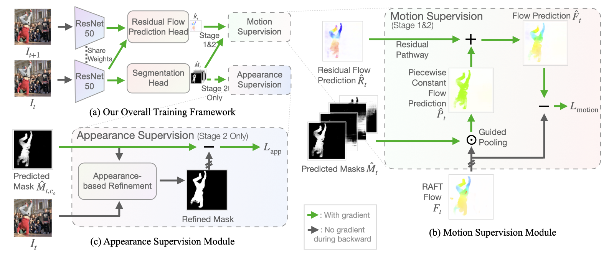

# Segmenting objects in videos **without human annotations**! 😲 🤯

# RCF: Bootstrapping Objectness from Videos by Relaxed Common Fate and Visual Grouping

by [Long Lian](https://tonylian.com/), [Zhirong Wu](https://scholar.google.com/citations?user=lH4zgcIAAAAJ&hl=en) and [Stella X. Yu](http://www1.icsi.berkeley.edu/~stellayu/) at UC Berkeley, MSRA, and UMich

<em>The IEEE/CVF Conference on Computer Vision and Pattern Recognition (CVPR), 2023.</em>

[[Paper](https://arxiv.org/abs/2304.08025)] | [[Project Page](https://rcf-video.github.io/)] | [[Presentation Video](https://www.youtube.com/watch?v=dyaDEvT4YkY)] | [[Demo Video](http://people.eecs.berkeley.edu/~longlian/RCF_video.html)] | [[Poster](https://rcf-video.github.io/poster.png)] | [[Citation](#citation)]

[](https://paperswithcode.com/sota/unsupervised-object-segmentation-on-davis?p=bootstrapping-objectness-from-videos-by)
[](https://paperswithcode.com/sota/unsupervised-object-segmentation-on-segtrack?p=bootstrapping-objectness-from-videos-by)
[](https://paperswithcode.com/sota/unsupervised-object-segmentation-on-fbms-59?p=bootstrapping-objectness-from-videos-by)

### **Non-cherry picked** segmentation predictions on all sequences on DAVIS16:


**This GIF has been significantly compressed. [Check out our video at full resolution here.](http://people.eecs.berkeley.edu/~longlian/RCF_video.html)** Inference in this demo is done *per-frame* without post-processing for temporal consistency.

If you want to qualitatively compare segmentation masks from our method without running our code, you can download the segmentation masks [here](#model-zoo-and-prediction-masks).

### Our Method in a Figure


## Data Preparation
### Prepare data and pretrained weights
Download [DAVIS 2016](https://graphics.ethz.ch/Downloads/Data/Davis/DAVIS-data.zip) and unzip to `data/data_davis`.

Download [pre-extracted flow from RAFT](https://huggingface.co/datasets/longlian/RCF-UnsupVideoSeg-Datasets/blob/main/flows_NewCT.tgz) (trained with chairs and things) and decompress to `data/data_davis`.

Download [DenseCL ResNet50 weights](https://cloudstor.aarnet.edu.au/plus/s/hdAg5RYm8NNM2QP/download) to `data/pretrained/densecl_r50_imagenet_200ep.pth`.

<details>
<summary>SegTrackv2 and FBMS59 dataset</summary>

These two datasets have much lower quality and very different aspect ratios across sequences. To make things easier, we resize to 480p (854x480) to have the same input size as DAVIS 2016. For fairness, the testing is still on the original dataset, and we provide both the original and scaled datasets (with flows on the scaled datasets). There are also larger inter-run variations on these two datasets compared to DAVIS 2016 since the video quality is lower and/or the number of sequences is smaller. I recommend using DAVIS16 as the main metric and use these two as supplementary metrics. For reproducibility, checkpoints for both stages for three datasets have been released.

Download [SegTrackv2 with pre-extracted flow](https://huggingface.co/datasets/longlian/RCF-UnsupVideoSeg-Datasets/blob/main/SegTrackv2_all.tgz).

Download [FBMS59 with pre-extracted flow part 1](https://huggingface.co/datasets/longlian/RCF-UnsupVideoSeg-Datasets/blob/main/FBMS59_all.tgz.part1) and [FBMS59 with pre-extracted flow part 2](https://huggingface.co/datasets/longlian/RCF-UnsupVideoSeg-Datasets/blob/main/FBMS59_all.tgz.part2). Please use `cat FBMS59_all.tgz.part1 FBMS59_all.tgz.part2 > FBMS59_all.tgz` to merge before un-targz. `shasum` of the merged file: `e898c127f916de867dad665bbb04e21702e54e7c`.
</details>

### Install dependencies and `torchCRF`
The `requirements.txt` assumes CUDA 11.x. You can also install torch and torchvision from conda instead of pip.

`torchCRF` is a GPU CRF implementation typically faster than CPU implementation. If you plan to use this implementation in your work, see the `tools/torchCRF/README.md` for license.

```
pip install -r requirements.txt
cd tools/torchCRF
python setup.py install
```

We also require `parallel` command from moreutils. If your parallel does not work (for example, the parallel from parallel package), you either need to install moreutils from system package manager (e.g. APT on Ubuntu/Debian) or from conda: `conda install -c conda-forge moreutils`.

## Model Zoo and Prediction Masks
We provide pretrained models and prediction masks. If you intend to work on a custom dataset that is out-of-distrbution for our training data such as DAVIS16, we suggest training/fine-tuning our model on new datasets.

| Name               | Dataset | Backbone | mIoU (w/o pp.)    | mIoU (w/ pp.) | Model    | Masks    |
| ------------------ | ------- | -------- | ----------------- | ------------- | -------- | -------- |
| RCF (All stages)   | DAVIS16 | ResNet50 | 80.9              | **83.0**      | [Download](https://drive.google.com/drive/folders/1I9xYL4BZO8Dr6s3FzNZhN_QpGAU-_AzD?usp=share_link) | [Download](https://drive.google.com/drive/folders/1RjNpRM33IACSqN30-W6W14eAZddnwBYh?usp=share_link) |
| RCF (Stage 1 only) | DAVIS16 | ResNet50 | 78.9              | 81.4          | [Download](https://drive.google.com/drive/folders/1I9xYL4BZO8Dr6s3FzNZhN_QpGAU-_AzD?usp=share_link) | [Download](https://drive.google.com/drive/folders/1RjNpRM33IACSqN30-W6W14eAZddnwBYh?usp=share_link) |
| RCF (All stages)  |SegTrackv2| ResNet50 | 76.7              | **79.6**      | [Download](https://drive.google.com/drive/folders/1kD7t0TjCUpW8QRVDnnjq-_PGpHJvDVfF?usp=share_link) | [Download](https://drive.google.com/drive/folders/1pr2SZ_qabgDDxYaV3Zh-tXWQ2c9yPRNx?usp=share_link) |
| RCF (Stage 1 only)|SegTrackv2| ResNet50 | 72.8              | 77.6          | [Download](https://drive.google.com/drive/folders/1kD7t0TjCUpW8QRVDnnjq-_PGpHJvDVfF?usp=share_link) | [Download](https://drive.google.com/drive/folders/1pr2SZ_qabgDDxYaV3Zh-tXWQ2c9yPRNx?usp=share_link) |
| RCF (All stages)   | FBMS59  | ResNet50 | 69.9              | **72.4**      | [Download](https://drive.google.com/drive/folders/1jNBK0Ol2obFPQT9AFmHJ_HStdnlYwZHx?usp=share_link) | [Download](https://drive.google.com/drive/folders/1jOb6G07FVaRNhBWBfoI-KS2f15u2bMkd?usp=share_link) |
| RCF (Stage 1 only) | FBMS59  | ResNet50 | 66.8              | 69.1          | [Download](https://drive.google.com/drive/folders/1jNBK0Ol2obFPQT9AFmHJ_HStdnlYwZHx?usp=share_link) | [Download](https://drive.google.com/drive/folders/1jOb6G07FVaRNhBWBfoI-KS2f15u2bMkd?usp=share_link) |

To evaluate a pretrained model using our unofficial main training script and/or the masks for evaluation using evaluation tools, use `--test-override-pretrained` and `--test-override-object-channel` to specify the model path and the object channel, respectively.

## Train RCF
### Stage 1
To train our model on DAVIS16 with 2 GPUs, run:
```shell
CUDA_VISIBLE_DEVICES=0,1 python -m torch.distributed.run --master_addr 127.0.0.1 --master_port 9000 --nproc_per_node gpu main.py configs/rcf/rcf_stage1.yaml
```
This should lead to a model with mIoU around 78% to 79% on DAVIS16 (without post-processing). Run stage 2 as well if additional gains are desired. If you want to run with other numbers of GPUs, change `CUDA_VISIBLE_DEVICES` and the `batch_size` so that the total batch size (`batch_size` times the number of GPUs) is your intended batch size (16 in this config).

<details>
<summary>SegTrackv2 and FBMS59 dataset</summary>
Training with STv2 and FBMS59 is very similar to training with DAVIS16.

STv2:

```shell
CUDA_VISIBLE_DEVICES=0,1 python -m torch.distributed.run --master_addr 127.0.0.1 --master_port 9000 --nproc_per_node gpu main.py configs/rcf_stv2/rcf_stage1.yaml
```

FBMS59:

```shell
CUDA_VISIBLE_DEVICES=0,1 python -m torch.distributed.run --master_addr 127.0.0.1 --master_port 9000 --nproc_per_node gpu main.py configs/rcf_fbms59/rcf_stage1.yaml
```

</details>

### Stage 2.1 (Low-level refinement)
This stage uses Conditional Random Field (CRF) to get training signals based on low-level vision (e.g., color). Prior to running this stage, we need to get the object channel through motion-appearance alignment.
```shell
CUDA_VISIBLE_DEVICES=0 python tools/SemanticConstraintsAndMAA/maa.py --pretrain_dir saved/saved_rcf_stage1 --first-frames-only --step 43200
OBJECT_CHANNEL=$?
```

Then we could run training (which will continue training from pretrained stage 1 model):
```shell
CUDA_VISIBLE_DEVICES=0,1 python -m torch.distributed.run --master_addr 127.0.0.1 --master_port 9000 --nproc_per_node gpu main.py configs/rcf/rcf_stage2.1.yaml --opts object_channel $OBJECT_CHANNEL
```

<details>
<summary>SegTrackv2 and FBMS59 dataset</summary>
Training with STv2 and FBMS59 is very similar to training with DAVIS16.

STv2:

```shell
CUDA_VISIBLE_DEVICES=0 python tools/SemanticConstraintsAndMAA/maa.py --pretrain_dir saved_stv2/saved_rcf_stage1 --first-frames-only --step 1220 --dataset stv2
OBJECT_CHANNEL=$?
CUDA_VISIBLE_DEVICES=0,1 python -m torch.distributed.run --master_addr 127.0.0.1 --master_port 9000 --nproc_per_node gpu main.py configs/rcf_stv2/rcf_stage2.1.yaml --opts object_channel $OBJECT_CHANNEL
```

FBMS59:

```shell
CUDA_VISIBLE_DEVICES=0 python tools/SemanticConstraintsAndMAA/maa.py --pretrain_dir saved_fbms59/saved_rcf_stage1 --first-frames-only --step 3468 --dataset fbms59 --num-channels 3
OBJECT_CHANNEL=$?
CUDA_VISIBLE_DEVICES=0,1 python -m torch.distributed.run --master_addr 127.0.0.1 --master_port 9000 --nproc_per_node gpu main.py configs/rcf_fbms59/rcf_stage2.1.yaml --opts object_channel $OBJECT_CHANNEL
```

</details>

### Stage 2.2 (Semantic constaints)
This stage uses a pretrained ViT model from DINO to get training signals based on high-level vision (e.g., semantics discovered in unsupervised learning). Semantic constraints are enforced offline due to its low speed.
```shell
# the predictions on trainval
CUDA_VISIBLE_DEVICES=0 python main.py configs/rcf/rcf_export_trainval_ema.yaml --test --test-override-pretrained saved/saved_rcf_stage2.1/last.ckpt --opts checkpoints_dir saved/saved_rcf_stage2.1 object_channel $OBJECT_CHANNEL
# run semantic constraints
CUDA_VISIBLE_DEVICES=0 python tools/SemanticConstraintsAndMAA/semantic_constraints.py --pretrain_dir saved/saved_rcf_stage2.1 --object-channel $OBJECT_CHANNEL
# training with semantic constraints
CUDA_VISIBLE_DEVICES=0,1 python -m torch.distributed.run --master_addr 127.0.0.1 --master_port 9000 --nproc_per_node gpu main.py configs/rcf/rcf_stage2.2.yaml --opts object_channel $OBJECT_CHANNEL train_dataset_kwargs.pl_root saved/saved_rcf_stage2.1/saved_eval_export_trainval_ema_torchcrf_ncut_torchcrf/$OBJECT_CHANNEL
```

This should give you a 80% to 81% mIoU (without post-processing).

<details>
<summary>SegTrackv2 and FBMS59 dataset</summary>
STv2:

```shell
# the predictions on trainval
CUDA_VISIBLE_DEVICES=0 python main.py configs/rcf_stv2/rcf_export_trainval_ema.yaml --test --test-override-pretrained saved_stv2/saved_rcf_stage2.1/last.ckpt --opts checkpoints_dir saved_stv2/saved_rcf_stage2.1 object_channel $OBJECT_CHANNEL
# run semantic constraints
CUDA_VISIBLE_DEVICES=0 python tools/SemanticConstraintsAndMAA/semantic_constraints.py --pretrain_dir saved_stv2/saved_rcf_stage2.1 --object-channel $OBJECT_CHANNEL --dataset stv2
# training with semantic constraints
CUDA_VISIBLE_DEVICES=0,1 python -m torch.distributed.run --master_addr 127.0.0.1 --master_port 9000 --nproc_per_node gpu main.py configs/rcf_stv2/rcf_stage2.2.yaml --opts object_channel $OBJECT_CHANNEL train_dataset_kwargs.pl_root saved_stv2/saved_rcf_stage2.1/saved_eval_export_ema_torchcrf_ncut_torchcrf/$OBJECT_CHANNEL
```

FBMS59:

```shell
# the predictions on trainval
CUDA_VISIBLE_DEVICES=0 python main.py configs/rcf_fbms59/rcf_export_trainval_ema.yaml --test --test-override-pretrained saved_fbms59/saved_rcf_stage2.1/last.ckpt --opts checkpoints_dir saved_fbms59/saved_rcf_stage2.1 object_channel $OBJECT_CHANNEL
# run semantic constraints
CUDA_VISIBLE_DEVICES=0 python tools/SemanticConstraintsAndMAA/semantic_constraints.py --pretrain_dir saved_fbms59/saved_rcf_stage2.1 --object-channel $OBJECT_CHANNEL --dataset fbms59 --num-channels 3
# training with semantic constraints
CUDA_VISIBLE_DEVICES=0,1 python -m torch.distributed.run --master_addr 127.0.0.1 --master_port 9000 --nproc_per_node gpu main.py configs/rcf_fbms59/rcf_stage2.2.yaml --opts object_channel $OBJECT_CHANNEL train_dataset_kwargs.pl_root saved_fbms59/saved_rcf_stage2.1/saved_eval_export_trainval_ema_torchcrf_ncut_torchcrf/$OBJECT_CHANNEL
```

</details>

## Evaluate
### Without CRF Post-processing
To unofficially evaluate a trained model, run:
```shell
CUDA_VISIBLE_DEVICES=0 python main.py configs/rcf/rcf_eval.yaml --test --test-override-pretrained saved/saved_rcf_stage2.2/last.ckpt --test-override-object-channel $OBJECT_CHANNEL
```
We encourage evaluating the model with our evaluation tool, which is supposed to closely match the DAVIS 2016 official evaluation tool.
To evaluate a trained model with the evaluation tool on the exported masks (stage 2.2 will masks on validation set by default):
```shell
python tools/davis2016-evaluation/evaluation_method.py --task unsupervised --davis_path data/data_davis --year 2016 --step 4320 --results_path saved/saved_rcf_stage2.2/saved_eval_export
```

### With CRF Post-processing
To refine the exported masks from a trained model with CRF post-processing, run:
```shell
sh tools/pydenseCRF/crf_parallel.sh
```

Then evaluate the refined masks with evaluation tool:
```shell
python tools/davis2016-evaluation/evaluation_method.py --task unsupervised --davis_path data/data_davis --year 2016 --step 4320 --results_path saved/saved_rcf_stage2.2/saved_eval_export_crf
```

This should reproduce around 83% mIoU (J-FrameMean).

<details>
<summary>Evaluate SegTrackv2 and FBMS59 dataset</summary>
We provide a tool to evaluate exported masks of SegTrackv2 and FBMS59:

```shell
python tools/STv2-FBMS59-evaluation/eval_tool.py --dataset SegTrackv2 --pred_dir [pred dir] --step [step num]
```
```shell
python tools/STv2-FBMS59-evaluation/eval_tool.py --dataset FBMS59 --pred_dir [pred dir] --step [step num]
```

</details>

## Train AMD (our baseline method)
This repo also supports training [AMD](https://github.com/rt219/The-Emergence-of-Objectness). However, this implementation is not guaranteed to be identical to the original one. In our experience, it reproduces results that are slightly better than the original reported results without test-time adaptation (i.e., fine-tuning on the downstream data). The setup for training set (Youtube-VOS) is simply unzipping the `train_all_frames.zip` from Youtube-VOS to `data/youtube-vos/train_all_frames`. The setup for validation sets are the same as RCF.

```shell
CUDA_VISIBLE_DEVICES=0,1 python -m torch.distributed.run --master_addr 127.0.0.1 --master_port 9000 --nproc_per_node gpu main.py configs/amd/amd.yaml
```

## Support
If you have any questions on the paper or this implementation, please contact Long Lian using the email address in the paper.

## Citation
Please give us a star 🌟 on Github to support us!

Please cite our work if you find our work inspiring or use our code in your work:
```
@InProceedings{Lian_2023_CVPR,
    author    = {Lian, Long and Wu, Zhirong and Yu, Stella X.},
    title     = {Bootstrapping Objectness From Videos by Relaxed Common Fate and Visual Grouping},
    booktitle = {Proceedings of the IEEE/CVF Conference on Computer Vision and Pattern Recognition (CVPR)},
    month     = {June},
    year      = {2023},
    pages     = {14582-14591}
}

@article{lian2022improving,
  title={Improving Unsupervised Video Object Segmentation with Motion-Appearance Synergy},
  author={Lian, Long and Wu, Zhirong and Yu, Stella X},
  journal={arXiv preprint arXiv:2212.08816},
  year={2022}
}
```


# modify from Tianming
in eval stage to select the object channel 

```
python maa.py --pretrain_dir path/to/your/pretrained_rcf_folder --dataset davis --num-channels 4 --first-frames-only

CUDA_VISIBLE_DEVICES=0 python tools/SemanticConstraintsAndMAA/maa.py \
    --pretrain_dir saved/pretrained_rcf \
    --dataset davis \
    --num-channels 4 \
    --step 0 \
    --first-frames-only
```

## DINO-guided RCF on CMC Surgical Instrument Dataset

Three-stage pipeline for training and evaluating on `data_medical` / `CMC_grasp10_deinterlaced`.

### Phase 1 — DINO-guided training on data_medical
Config: `configs/instrument/rcf_cmc_dino_phase1.yaml`
```shell
CUDA_VISIBLE_DEVICES=0 python main_dino.py configs/instrument/rcf_cmc_dino_phase1.yaml
```

### Phase 2 — Fine-tune on CMC_grasp10 (4-fold cross-validation)
Config: `configs/instrument/rcf_cmc_grasp10_finetune_dino.yaml`
```shell
# Run all 4 folds sequentially (recommended)
bash script/run_grasp10_finetune.sh all 0

# Or run a single fold
bash script/run_grasp10_finetune.sh 1 0
```

### Evaluation — Full 601-sequence eval across checkpoints
Config: `configs/instrument/rcf_cmc_grasp10_eval.yaml`
```shell
# Evaluate best checkpoints from all folds on full 601 sequences
bash script/run_grasp10_eval_full.sh 0

# Evaluate a single checkpoint on a specific fold val split
bash script/run_grasp10_eval_fold.sh 1 saved/grasp10_ft_fold1_<timestamp>/last.ckpt 0
```

---

## Grasp10 Fine-tuning Configs: v4 / v9 / v11

These three configs represent successive attempts to improve fine-tuning on `CMC_grasp10_deinterlaced`.
All use **4-fold stratified cross-validation** (each fold val set contains ~27% 1080p + ~73% 720p,
matching the overall dataset ratio) and **full-resolution sliding-window evaluation**
(window 384×384, stride 192) — the val metric is therefore directly comparable to real inference.

### Dataset resolution breakdown

| Resolution | Format | Short side | Share |
|---|---|---|---|
| 720×576 | PAL 5:4 | 576 px | 72.9% |
| 1920×1080 | 16:9 | 1080 px | 27.1% |

### Config comparison

| Config | 720×576 crop | 1080p crop | BN consistency | 4-fold avg best mIoU |
|---|---|---|---|---|
| **v4** | resize400 → crop384 | resize576 → crop**512** | ✗ train512/val384 mismatch | 66.89% |
| **v9** | resize400 → crop384 | resize576 → crop**384** | ✓ always 384×384 | **67.10%** |
| **v11** | resize400 → crop384 | resize576 → half\_crop384 | ✓ always 384×384 | 63.67% |

**v4** introduced resolution-aware cropping so 1080p images are less compressed (1.88× vs 2.7×),
but the model sees 512×512 patches during training and 384×384 windows at val — BatchNorm
running statistics diverge between the two sizes, causing instability on 1080p sequences.

**v9** fixes this by using crop=384 for 1080p as well, so BatchNorm always sees 384×384 inputs
(matching both the phase-1 pre-training and the sliding-window val). Width crop coverage for 1080p
drops from 50% to 38%, but the BN consistency gain outweighs the loss, especially for fold 2
(63.03% → 69.09%).

**v11** additionally restricts the 1080p random-crop x-offset to either the left half or right half
of the resized image (50/50). Each crop then covers 75% of its assigned half instead of 37.5% of the
full width. Flow vectors are unaffected because both image frames and all flow fields are cropped
from the same bbox. In practice the reduced x-offset diversity hurt training stability, so v9 remains
the recommended config.

### How to run

```shell
# v4 — all 4 folds sequentially on GPU 0
bash script/run_grasp10_ft_v4.sh all 0

# v9 — all 4 folds sequentially on GPU 0  (recommended)
bash script/run_grasp10_ft_v9.sh all 0

# v11 — all 4 folds sequentially on GPU 1
bash script/run_grasp10_ft_v11.sh all 1

# Run a single fold (e.g. fold 2 on GPU 1)
bash script/run_grasp10_ft_v9.sh 2 1
```

All scripts cold-start from the phase-1 checkpoint
(`saved/cmc_dino_phase1_260605_143205/epoch=7-step=1800.ckpt`),
train for 30 epochs at lr=3e-5, and save per-epoch checkpoints plus tensorboard logs under
`saved/grasp10_ft_<version>_fold<N>_<timestamp>/`.

### Key implementation details

**ResolutionAwareCrop** (`dataset/transforms.py`) — dispatches each image to the matching
`resolution_crop_configs` entry based on the original short side, then applies Resize + RandomCrop
(or half-constrained crop for v11). Supported per-entry options:

| Option | Type | Effect |
|---|---|---|
| `max_short_side` | int | upper bound of short side for this entry (ascending order) |
| `resize_short` | int | target short side passed to Resize |
| `crop_size` | [h, w] | RandomCrop output size |
| `split_wide` | bool | split landscape images (AR>1.5) into left/right halves before resize (v10 only — **not recommended**, breaks precomputed flow) |
| `half_crop` | bool | restrict x-offset to left or right half after resize (v11) |

Val always uses a plain `Resize(resize_short=400)` followed by sliding-window inference —
no crop options apply at evaluation time.

---

## Grasp0 Soft-Tissue Fine-Tuning (RCFSoftTissueModel)

### Background

Starting from the best `grasp10_ft_v9` checkpoint (instrument detector, ch1 = instrument),
we fine-tune on `CMC_grasp0_deinterlaced` to learn a **three-region segmentation**:

| Channel | Semantic role |
|---------|---------------|
| ch0 | background (rigid, no contact) |
| ch1 | surgical instrument (protected, already trained) |
| ch2 | soft tissue (grasped / deforming) — **target of this stage** |
| ch3/ch4 | additional background channels |

The model is `RCFSoftTissueModel` (inherits `RCFDinoModel` → `RCFModel`).
Training entry point: `main_tissue.py`.
Config: `configs/instrument/rcf_cmc_grasp0_tissue_ft.yaml`.

### All implemented losses

#### Always-on base losses

| Loss | Symbol | Formula | Purpose |
|------|--------|---------|---------|
| **L_seg** | `w_seg` | L1(P̂ + R, RAFT_flow) — flow reconstruction | Core RCF motion-segmentation objective. P̂ = piecewise-constant flow per channel, R = per-channel residual flow. |
| **L_entropy** | `w_entropy` | −∑ p·log(p) on channel softmax | Push masks to be hard (each pixel dominated by one channel). |
| **L_dino** | `w_dino` | Mask-weighted cosine distance in frozen DINO ViT feature space | Visual coherence: pixels in the same mask region should have similar DINO features. |

#### Instrument protection

| Loss | Symbol | Formula | Purpose |
|------|--------|---------|---------|
| **L_distill** | `w_distill` | BCE(student_ch1_mask, teacher_ch1_mask) | Soft distillation from frozen grasp10 teacher. Prevents ch1 (instrument) from degrading during grasp0 fine-tuning. This is a soft constraint — ch1 can still shift, but is penalized for drifting too far from the teacher. |

#### Unsupervised tissue-vs-background losses (channel-agnostic)

These losses operate on **all non-instrument channels** (i.e., everything except `instrument_channels=[1]`).
They do not hard-assign "tissue = ch2"; instead, softmax competition determines which channel wins.

| Loss | Symbol | Formula | Purpose |
|------|--------|---------|---------|
| **L_deform** | `w_deform` | Maximize ∑_c∈non-inst  mean\_mask_c(‖R_c‖) | Instrument has R≈0 (rigid-body motion, P̂ sufficient). Soft tissue has large R (non-rigid deformation). This loss rewards whichever non-instrument channel covers high-residual-magnitude pixels. |
| **L_div_tissue** | `w_div_tissue` | Maximize ∑_c∈non-inst  mean\_mask_c(&#124;div(RAFT_flow)&#124;) | Grasped tissue is compressed/stretched → RAFT optical flow has non-zero divergence. Background and rigid structures have div≈0. Signal is **external** (from RAFT, not from the network). |
| **L_contact** | `w_contact` | Maximize ∑_c∈non-inst  mean activation in soft-dilation ring around ch1 boundary | Encourage tissue channels to cluster near the instrument (contact region). Implemented via max-pool soft dilation. **Currently disabled** (w_contact=0). |

#### Annotation-driven losses (disabled in pure unsupervised mode)

These require grasp / dissection point coordinates from annotations.

| Loss | Symbol | Formula | Purpose |
|------|--------|---------|---------|
| **L_grasp_flow** | `w_grasp_flow` | Align ch2 flow with RAFT flow at annotated grasp point | Direct signal at tissue contact point. Disabled (unreliable annotations). |
| **L_dissect** | `w_dissect` | Gaussian activation at annotated dissection point for ch2 | Tissue should activate near the dissection locus. Disabled. |

#### Older V2 losses (disabled)

| Loss | Symbol | Purpose |
|------|--------|---------|
| **L_rigid** | `w_rigid` | Penalize ‖R_c‖ for instrument channels (enforce rigidity). Superseded by L_distill. |
| **L_grasp_conv** | `w_grasp_conv` | Grasping channel aligns with flow divergence. Superseded by L_div_tissue. |
| **L_align** | `w_align` | Tissue flow direction aligns with grasping-channel mean flow. |
| **L_motion** | `w_motion` | Tissue motion magnitude > background motion magnitude. |

---

### Experiment v1 — first unsupervised run (2026-06-15)

**Config:** `configs/instrument/rcf_cmc_grasp0_tissue_ft.yaml`
**Script:** `script/run_grasp0_tissue_ft.sh`
**Run dir:** `saved/grasp0_tissue_ft_260615_102513/`
**Pretrained from:** `saved/grasp10_ft_v9_fulltrain_ft_260609_213030/epoch=0-step=149.ckpt`

#### Loss weights

| Loss | Weight | Status |
|------|--------|--------|
| L_seg | 1.0 | ✅ on |
| L_entropy | 0.05 | ✅ on |
| L_dino | 0.05 | ✅ on |
| L_distill | 0.1 | ✅ on — protects ch1 (instrument) |
| L_deform | 0.05 | ✅ on — channel-agnostic residual magnitude |
| L_div_tissue | 0.05 | ✅ on — channel-agnostic RAFT flow divergence |
| L_contact | 0.0 | ❌ off |
| L_grasp_flow | 0.0 | ❌ off (annotation-driven, disabled) |
| L_dissect | 0.0 | ❌ off (annotation-driven, disabled) |
| L_rigid | 0.0 | ❌ off |
| L_grasp_conv | 0.0 | ❌ off |
| L_align | 0.0 | ❌ off |
| L_motion | 0.0 | ❌ off |

#### Key design choices in v1

- **Channel-agnostic**: no loss hard-codes tissue = ch2; softmax competition decides.
- **Pure unsupervised**: zero annotation-driven losses; relies only on RAFT flow + DINO features.
- **Soft ch1 protection**: L_distill (w=0.1) is a soft regularizer — ch1 mask can still drift slightly but is penalized for diverging from the frozen teacher prediction.
- **Baseline val_miou at epoch 0 start: 86.15%** (ch1 instrument mIoU on CMC_grasp10, monitored throughout training to detect ch1 degradation).

---

### Experiment v3 — Run 204 (2026-06-15)

**Config:** `configs/instrument/rcf_cmc_grasp0_tissue_ft_v3.yaml`
**Run dir:** `saved/grasp0_tissue_ft_v3_260615_112039/`
**Pretrained from:** `saved/grasp10_ft_v9_fulltrain_ft_260609_213030/epoch=0-step=149.ckpt`

**Key changes vs v1:** w_dino 0.05→0.05 (kept), w_deform 0.05→**0.5** (10×), w_div_tissue 0.05→**0.5** (10×), w_distill 0.1→**0.8**.

#### Loss weights

| Loss | Weight | Notes |
|------|--------|-------|
| L_seg | 1.0 | ✅ on |
| L_entropy | 0.1 | ✅ on |
| L_dino | 0.05 | ✅ on — DINO spatial prior |
| L_distill | 0.8 | ✅ on — ch1 BCE distillation (bidirectional) |
| L_deform | 0.5 | ✅ on — residual magnitude in non-inst channels |
| L_div_tissue | 0.5 | ✅ on — RAFT flow divergence in non-inst channels |
| L_rigid_tissue | 0.0 | ❌ off |
| L_flow_cosine | 0.0 | ❌ off |
| L_contact | 0.0 | ❌ off |

#### val_miou per epoch (CMC_grasp10, ch1 instrument)

| Ep | 0 | 1 | 2 | 3 | 4 | 5 | 6 | 7 | 8 | 9 | 15 | 20 | 25 | 29 |
|----|---|---|---|---|---|---|---|---|---|---|----|----|----|-----|
| mIoU | 63.47 | 61.57 | **69.10** | 68.46 | 68.35 | 68.59 | 67.79 | 68.32 | 65.60 | 60.47 | 62.08 | 61.70 | 61.56 | 61.51 |

**Result:** Recovers to ~68-69% by epoch 2-7 (DINO prior helps), then drops back to 61-64% as deform/div pull ch1 away from instrument. Best: **69.10%** (epoch 2). Late convergence plateau: 61-64%.

**Key finding:** DINO prior provides spatial structure early on but the div_tissue signal is concentrated at boundaries (instrument-tissue interface), creating oscillating adversarial gradients that destabilize training after epoch 8.

---

### Experiment v4 — Run 206 (2026-06-15)

**Config:** `configs/instrument/rcf_cmc_grasp0_tissue_ft_v4.yaml`
**Run dir:** `saved/grasp0_tissue_ft_v4_260615_115553/`
**Pretrained from:** `saved/grasp10_ft_v9_fulltrain_ft_260609_213030/epoch=0-step=149.ckpt`

**Key changes vs v3:** w_dino **0.05→0.0** (disabled), w_deform 0.5→**0.3**, w_div_tissue 0.5→**2.0** (4×), w_distill 0.8→**1.0**, w_entropy 0.1→0.1.

Hypothesis: DINO spatial prior was causing block-shaped masks (DINO quadrant bias). Disabling DINO and strengthening div_tissue to be the primary tissue signal.

#### Loss weights

| Loss | Weight | Notes |
|------|--------|-------|
| L_seg | 1.0 | ✅ on |
| L_entropy | 0.1 | ✅ on |
| L_dino | 0.0 | ❌ off — disabled, spatial bias confirmed harmful |
| L_distill | 1.0 | ✅ on — ch1 BCE distillation (bidirectional) |
| L_deform | 0.3 | ✅ on |
| L_div_tissue | 2.0 | ✅ on — primary tissue signal (4× stronger) |
| L_rigid_tissue | 0.0 | ❌ off |
| L_flow_cosine | 0.0 | ❌ off |

#### val_miou per epoch

| Ep | 0 | 1 | 2 | 3 | 4 | 5 | 6 | 7 | 8 | 9 | 15 | 20 | 25 | 29 |
|----|---|---|---|---|---|---|---|---|---|---|----|----|----|-----|
| mIoU | **70.16** | 65.97 | 61.47 | 61.76 | 61.11 | 61.15 | 59.19 | 58.72 | 59.38 | 60.57 | 59.09 | 58.80 | 58.01 | 57.99 |

**Result:** Good start (70.16% epoch 0) but consistently declining. Late plateau 57-60% — **worse than v3**. Best: **70.16%** (epoch 0).

**Key finding:** div_tissue at w=2.0 dominates the gradient but the signal is physically concentrated at flow-boundary pixels (where flow direction changes sharply). These pixels lie exactly at the instrument-tissue interface, so both instrument and tissue channels cover them, producing oscillating gradients and no stable assignment. Raising w_div_tissue amplifies the instability rather than improving tissue separation.

---

### Experiment v6 — Run 208 (2026-06-15)  *(deform-only ablation)*

**Config:** `configs/instrument/rcf_cmc_grasp0_tissue_ft_v6.yaml`
**Run dir:** `saved/grasp0_tissue_ft_v6_260615_180411/`
**Pretrained from:** `saved/grasp10_ft_v9_fulltrain_ft_260609_213030/epoch=0-step=149.ckpt`

**Key changes vs v4:** w_dino=0.0 (keep off), w_div_tissue **2.0→0.0** (disabled — confirmed boundary-only signal), w_deform **0.3→0.5** (restore), w_entropy **0.1→0.05**, w_distill=1.0.
Ablation: trust deform alone; remove div_tissue entirely.

#### Loss weights

| Loss | Weight | Notes |
|------|--------|-------|
| L_seg | 1.0 | ✅ on |
| L_entropy | 0.05 | ✅ on |
| L_dino | 0.0 | ❌ off |
| L_distill | 1.0 | ✅ on — ch1 BCE distillation (bidirectional) |
| L_deform | 0.5 | ✅ on — only tissue signal |
| L_div_tissue | 0.0 | ❌ off — boundary-only, adversarial gradients |
| L_rigid_tissue | 0.0 | ❌ off |
| L_flow_cosine | 0.0 | ❌ off |

#### val_miou per epoch

| Ep | 0 | 1 | 2 | 3 | 4 | 5 | 10 | 15 | 16 | 17 | 22 | 25 | 29 |
|----|---|---|---|---|---|---|----|----|----|----|----|----|-----|
| mIoU | 68.94 | 67.97 | 63.27 | 60.64 | 60.39 | 59.96 | 60.28 | 62.23 | **62.55** | 60.90 | 62.07 | 59.07 | 59.83 |

**Result:** Plateau at 59-62%, best **62.55%** (epoch 16). loss_deform decreases monotonically (−0.27→−1.16) throughout training, confirming the residual signal is working — but val_miou stops improving, indicating deform alone cannot distinguish tissue sub-types (all tissue regions are pulled into a single homogeneous blob). Late-epoch decline (ep22→29) likely due to LR decay over-fitting warp reconstruction.

**Key finding:** **62.55% is the deform-only ceiling.** Serves as the ablation baseline for v8 (flow_cosine). Any improvement in v8 is attributable to L_flow_cosine.

---

### Experiment v7 — Run 209 (2026-06-15)  *(deform + flow-variance)*

**Config:** `configs/instrument/rcf_cmc_grasp0_tissue_ft_v7.yaml`
**Run dir:** `saved/grasp0_tissue_ft_v7_260615_181208/`
**Pretrained from:** `saved/grasp10_ft_v9_fulltrain_ft_260609_213030/epoch=0-step=149.ckpt`

**Key changes vs v6:** adds **L_rigid_tissue** (w=0.005) — maximizes RAFT flow variance within each non-instrument channel mask. Area signal (not spatial gradient). Weight set small (0.005) because real-data loss_rigid_tissue ≈ −25 (vs random-input ≈ −2); at w=0.1 the contribution (−2.5) would dominate deform (−0.17). At w=0.005 the contribution (−0.125) is comparable to deform.

#### Loss weights

| Loss | Weight | Notes |
|------|--------|-------|
| L_seg | 1.0 | ✅ on |
| L_entropy | 0.05 | ✅ on |
| L_dino | 0.0 | ❌ off |
| L_distill | 1.0 | ✅ on — ch1 BCE distillation (bidirectional) |
| L_deform | 0.5 | ✅ on |
| L_rigid_tissue | 0.005 | ✅ on — maximize intra-channel RAFT flow variance |
| L_div_tissue | 0.0 | ❌ off |
| L_flow_cosine | 0.0 | ❌ off |

#### val_miou per epoch

| Ep | 0 | 1 | 2 | 3 | 4 | 5 | 8 | 9 | 10 | 15 | 20 | 25 | 29 |
|----|---|---|---|---|---|---|---|---|----|----|----|----|-----|
| mIoU | 68.90 | **70.59** | 67.71 | 64.16 | 61.84 | 64.13 | 62.13 | 63.55 | 63.32 | 61.75 | 59.93 | 60.08 | 59.69 |

**Result:** Early advantage over v6 (epoch 2-15 typically +1-4%), then converges to the same plateau (~59-62%) by epoch 20+. Best: **70.59%** (epoch 1, warmup). Late convergence same as v6.

**Key finding:** L_rigid_tissue provides a mild early benefit (the flow-variance signal gives additional push toward heterogeneous regions in the first ~15 epochs) but does not raise the long-term ceiling. Furthermore, L_rigid_tissue directly contradicts L_flow_cosine (rigid_tissue maximizes intra-channel flow variance; flow_cosine minimizes it) — **disabled in v8** to avoid gradient conflict.

---

### Experiment v8 — (planned, deform + flow-cosine)

**Config:** `configs/instrument/rcf_cmc_grasp0_tissue_ft_v8.yaml`
**Pretrained from:** `saved/grasp10_ft_v9_fulltrain_ft_260609_213030/epoch=0-step=149.ckpt`

**Key changes vs v6:** adds **L_flow_cosine** (w=0.5) — each non-instrument channel should cluster pixels with similar RAFT flow direction. Instrument pixels excluded via **teacher's** ch1 mask (not student's, to break the feedback loop where student ch1 drift → instrument pixels no longer excluded → flow_cosine pulls them to tissue channels). **L_distill changed from bidirectional BCE to one-sided relu(teacher−student)** — only penalizes ch1 dropout (student < teacher), not expansion, making it compatible with flow_cosine's competitive pressure. L_rigid_tissue disabled (contradicts flow_cosine).

#### Loss weights

| Loss | Weight | Notes |
|------|--------|-------|
| L_seg | 1.0 | ✅ on |
| L_entropy | 0.05 | ✅ on |
| L_dino | 0.0 | ❌ off |
| L_distill | 1.0 | ✅ on — **one-sided**: relu(teacher_ch1 − student_ch1), prevents ch1 dropout only |
| L_deform | 0.5 | ✅ on |
| L_flow_cosine | 0.5 | ✅ on — RAFT flow direction clustering, teacher mask excludes instrument |
| L_rigid_tissue | 0.0 | ❌ off — contradicts flow_cosine (opposite gradients on same channels) |
| L_div_tissue | 0.0 | ❌ off — boundary-only signal |

#### val_miou per epoch (run 212, in progress)

| Ep | 0 | 1 | 2 | 3 | 4 | 5 | 6 | 7 | 8 |
|----|---|---|---|---|---|---|---|---|---|
| mIoU | 67.91 | **69.01** | 67.37 | 67.25 | 65.61 | 62.99 | 62.30 | 62.97 | — |

**Observation (early):** Peak at epoch 1 (69.01%), then declining. Suspected cause: without a push-apart constraint, all non-instrument channel centroids (mu) converge to the same mean flow direction → cross-entropy target becomes uniform → signal degenerates. → Motivates v9 (add diversity loss).

#### Ablation baseline
v6 (deform only) ceiling = **62.55%**. Any improvement in v8/v9 is attributable to L_flow_cosine.

---

### Experiment v9 — (run 213, deform + flow-cosine + diversity)

**Config:** `configs/instrument/rcf_cmc_grasp0_tissue_ft_v9.yaml`
**Run dir:** `saved/grasp0_tissue_ft_v9/`
**Pretrained from:** `saved/grasp10_ft_v9_fulltrain_ft_260609_213030/epoch=0-step=149.ckpt`

**Key changes vs v8:** adds **L_flow_cosine_diversity** (weight=0.1 inside `flow_cosine_assignment_loss`) — minimises the mean pairwise cosine similarity between non-instrument channel centroids (mu vectors). Prevents channel collapse where all non-instrument channels converge to the same mean RAFT flow direction.

**Implementation detail:** diversity term recomputes mu **without detach** so the gradient flows back through masks. The main flow_cosine cross-entropy still uses detached mu as a pseudo-label. The two terms share the same forward pass — diversity adds one extra loop over channel pairs.

#### All loss weights

| Loss | Weight | Signal | Applies to | Notes |
|------|--------|--------|-----------|-------|
| **L_seg** (loss_warp_seg) | 1.0 | MSE(pred_flow, RAFT_flow) × boundary_mask | all channels | Core RCF flow reconstruction objective |
| **L_entropy** | 0.05 | −Σ p·log(p) on softmax | all channels | Sharpens masks, prevents soft boundaries |
| **L_dino** | 0.0 | DINO ViT feature cosine | — | Off — spatial quadrant bias confirmed harmful |
| **L_distill** | 1.0 | relu(teacher_ch1 − student_ch1) | ch1 only | One-sided: penalises ch1 dropout only, not expansion |
| **L_deform** | 0.5 | Mean ‖residual‖ within mask | non-inst channels | Network internal residual; area signal |
| **L_flow_cosine** | 0.5 | Cross-entropy vs mask-weighted mean RAFT flow direction | non-inst channels | Within-channel pull: each channel groups flow-similar pixels |
| **L_flow_diversity** | 0.1 | Mean pairwise cosine sim between channel mu vectors | non-inst channels | Between-channel push: prevents all channels collapsing to same direction |
| **L_rigid_tissue** | 0.0 | RAFT flow variance within mask | — | Off — contradicts L_flow_cosine |
| **L_div_tissue** | 0.0 | RAFT flow divergence | — | Off — boundary-only signal |
| **L_contact** | 0.0 | Mask activation near ch1 boundary | — | Off |

#### Gradient flow summary

```
ch1  ←── L_distill (one-sided relu, prevents dropout)
          L_seg (flow reconstruction)
          L_entropy

ch0, ch2, ch3, ch4 (non-inst) ←── L_deform      (cover high-residual pixels)
                                   L_flow_cosine  (pull: within-channel flow coherence)
                                   L_flow_diversity (push: between-channel flow divergence)
                                   L_seg, L_entropy
```

#### Design rationale

- **L_flow_cosine (pull)** alone creates degenerate solutions: all channels converge to the dominant flow direction (e.g., overall camera/instrument motion), leaving no distinction between channels.
- **L_flow_diversity (push)** breaks this symmetry: each channel is pushed toward a different "sector" of the flow direction space.
- Together they act like a **soft directional k-means**: pull assigns pixels to their nearest centroid, push keeps centroids separated.

#### val_miou per epoch (run 213, in progress)

| Ep | 0 | ... |
|----|---|-----|
| mIoU | (running) | — |

Ablation baseline: v8 (no diversity) best = **69.01%** (epoch 1). v6 (no flow_cosine) best = **62.55%**.

---

### Experiment v10 — (run 216, deform + flow-cosine + diversity + head reset)

**Config:** `configs/instrument/rcf_cmc_grasp0_tissue_ft_v10.yaml`
**Run dir:** `saved/grasp0_tissue_ft_v10_260615_204311/`
**Pretrained from:** `saved/grasp10_ft_v9_fulltrain_ft_260609_213030/epoch=0-step=149.ckpt`

**Key change vs v9:** `reset_non_instrument_heads: true` — at `on_train_start`, the non-instrument output rows (0, 2, 3, 4) of `decode_head2.conv_seg` are re-initialised with kaiming uniform. Channel 1 (instrument) weights are kept intact.

**Motivation:** The grasp10 pretrained model imprints strong priors on channels 0/2/3/4 that conflict with the grasp0 tissue partition. These priors resist fine-tuning and prevent the model from discovering a new tissue structure. Resetting only the final 1×1 classification conv (backbone untouched) gives non-instrument channels a clean slate, while L_distill quickly recovers ch1 instrument segmentation from the frozen teacher.

**Bug history (runs 214, 215):**
- Run 214: used `cls_seg` (a forward method in mmseg's BaseDecodeHead) instead of `conv_seg` (the actual `nn.Conv2d` weight attribute) — reset silently did nothing
- Run 215: placed `on_train_start` on `RCFSoftTissueModel` (a sub-module); Lightning only fires hooks on the top-level `TissueModel` — reset was never called
- Run 216: fixed by adding `on_train_start` to `TissueModel` in `main_tissue.py`, which calls `self.model._reset_non_instrument_mask_heads()`

**Reset confirmed in run 216 log:**
```
[RCFSoftTissueModel] reset_non_instrument_heads: re-initialised conv_seg rows [0, 2, 3, 4]  (kept rows [1])
```

step=10 loss comparison (reset effect):

| metric | run 215 (no reset) | run 216 (reset) |
|---|---|---|
| loss_warp_seg | 9.06 | **14.23** (random heads → higher reconstruction error) |
| loss_flow_cosine | 5.32 | **1.88** (uniform softmax → lower cosine assignment loss) |
| loss_entropy | 0.97 | **1.40** (softer masks from random init) |

**All loss weights (identical to v9):**

| Loss | Weight |
|------|--------|
| L_seg | 1.0 |
| L_entropy | 0.05 |
| L_distill | 1.0 (one-sided relu) |
| L_deform | 0.5 |
| L_flow_cosine | 0.5 |
| L_flow_diversity | 0.1 |
| L_rigid_tissue / L_dino / L_div_tissue | 0.0 |

#### val_miou per epoch (run 216, in progress)

| Ep | sanity | 0 | ... |
|----|--------|---|-----|
| mIoU | 86.15 (pretrained) | (running) | — |

Ablation baselines: v9 (same losses, no reset) in progress; v8 best = **69.01%**; v6 best = **62.55%**.

---

## Loss schedule overview (v1–v20)

> **Shared across all versions**: `w_seg=1.0`, `batch_size=8`, `optimizer=Adam(wd=1e-4)`, `teacher_ckpt=grasp10_ft_v9_fulltrain`
>
> **Always zero / never enabled**: `L_rigid`, `L_grasp_conv`, `L_align`, `L_motion`, `L_grasp_flow`, `L_dissect`, `L_contact`

| Ver | Ep | L_entropy | L_dino | L_deform | L_div_tissue | L_rigid_tissue | L_distill | distill_mode | distill anneal (ep≥5) | L_flow_cosine | fc_temp / diversity | L_flow_tv | TV: K / start_ep / margin | Reset |
|-----|-----|----------|--------|---------|-------------|--------------|---------|-------------|---------------------|-------------|-------------------|---------|--------------------------|-------|
| v1  | 30 | 0.05 | 0.05 | 0.05  | 0.05 | —     | 0.1 | BCE    | —            | —   | —         | —   | —               | none     |
| v2  | 30 | 0.05 | 0.05 | 1.0   | 0.5  | —     | 0.5 | BCE    | —            | —   | —         | —   | —               | none     |
| v3  | 30 | 0.10 | 0.05 | 0.5   | 0.5  | —     | 0.8 | BCE    | —            | —   | —         | —   | —               | none     |
| v4  | 30 | 0.10 | —    | 0.3   | 2.0  | —     | 1.0 | BCE    | —            | —   | —         | —   | —               | none     |
| v5  | 30 | 0.05 | —    | 0.5   | —    | 0.1   | 1.0 | BCE    | —            | —   | —         | —   | —               | none     |
| v6  | 30 | 0.05 | —    | 0.5   | —    | —     | 1.0 | BCE    | —            | —   | —         | —   | —               | none     |
| v7  | 30 | 0.05 | —    | 0.5   | —    | 0.005 | 1.0 | BCE    | —            | —   | —         | —   | —               | none     |
| v8  | 30 | 0.05 | —    | 0.5   | —    | —     | 1.0 | BCE    | —            | 0.5 | 0.5 / —   | —   | —               | none     |
| v9  | 30 | 0.05 | —    | 0.5   | —    | —     | 1.0 | BCE    | —            | 0.5 | 0.5 / 0.1 | —   | —               | none     |
| v10 | 30 | 0.05 | —    | 0.5   | —    | —     | 1.0 | BCE    | —            | 0.5 | 0.5 / 0.1 | —   | —               | partial① |
| v11 | 50 | 0.05 | —    | 0.5   | —    | —     | 1.0 | BCE    | —            | 0.5 | 0.5 / 0.1 | —   | —               | full②   |
| v12 | 50 | 0.05 | —    | 0.5   | —    | —     | 5.0 | sym③  | —            | 0.5 | 0.5 / 0.1 | —   | —               | full    |
| v13 | 50 | 0.05 | —    | 0.5   | —    | —     | 5.0 | sym③  | →0.5(relu)   | 0.5 | 0.5 / 0.2 | —   | —               | full    |
| v14 | 50 | 0.05 | —    | 0.5   | —    | —     | 5.0 | sym③  | →0.5(relu)   | 0.5 | 0.5 / 0.2 | 0.1 | 4 / **0** / —   | full    |
| v15 | 50 | 0.05 | —    | 0.5   | —    | —     | 5.0 | sym❌  | →0.5(relu)   | 0.5 | 0.5 / 0.2 | 0.5 | 5 / 5 / 0.3     | full    |
| v16 | 50 | 0.05 | —    | 0.5   | —    | —     | 5.0 | sym✓  | →0.5(relu)   | 0.5 | 0.5 / 0.2 | 0.5 | 5 / 5 / 0.3     | full    |
| v17 | 80 | 0.05 | —    | 0.5   | —    | —     | 1.0 | relu  | —            | 0.5 | 0.5 / 0.5 | 0.2 | 5 / 5 / 0.3     | none    |
| v18 | 80 | 0.05 | —    | 0.5   | —    | —     | 1.0 | relu  | —            | 0.5 | 0.5 / 0.5 | 0.2 | 5 / 5 / 0.3     | none    |
| v19 | 80 | 0.05 | —    | 0.5   | —    | —     | 1.0 | relu  | —            | 0.5 | 0.5 / 0.5 | **2.0** | 5 / 5 / 0.3 | none    |
| v20 | 80 | **0.10** | —  | 0.5   | —    | —     | 1.0 | relu  | —            | 0.5 | 0.5 / 0.5 | **2.0** | 5 / 5 / 0.3 | none    |

**Notes**

① v10 `reset_non_instrument_heads=true`: re-initialises only conv_seg rows ch0/2/3/4; ch1 weights are kept

② v11–v16 `reset_full_decode_head=true`: re-initialises all parameters of decode_head2 (including ch1)

③ v12–v14 ran on **old code** where `distill_mode` had no effect (always BCE); v14 ch1 collapse was caused by `L_flow_tv` active from ep0 (fixed via `flow_tv_start_epoch=5`)

❌ v15 ran on **new code** where symmetric was implemented as MSE (bounded gradient); ch1 could not recover against warp_seg and collapsed

✓ v16 fix: symmetric restored to BCE (gradient ∝ teacher/student, diverges near zero → always dominates)

④ v18 identical to v17 except `lr=3e-5`; analysis showed faster train-loss drop but higher entropy (mask diffusion) and unstable val_miou → high LR too aggressive

⑤ v19 vs v17: `w_flow_tv` raised from 0.2 → 2.0 to bring TV loss to ~¼ of cosine strength and better enforce flow-cluster boundary alignment

⑥ v20 vs v19: `w_entropy` raised from 0.05 → 0.10 to push against mask graying in ambiguous low-flow regions

---

## Loss schedule overview (v21–v26)

> **Key shift**: Replace `L_flow_tv` (gradient dead zone confirmed in v19/v20) with `L_flow_cluster_ce` (K-means color-block CE, external targets).
>
> **Core insight**: `L_flow_cosine` is self-referential — its CE target μ_c is derived from the current mask, so it reinforces the pretrained prior rather than breaking it. `L_flow_cluster_ce` uses external RAFT K-means labels (independent of current mask) and is therefore the true prior-breaking force for aligning non-instrument channels with RAFT flow color blocks.

| Ver | Ep | L_entropy | L_deform | L_distill | L_flow_cosine | L_flow_cluster_ce | fcc: temp / div / start_ep | K-means | Notes |
|-----|-----|----------|---------|---------|-------------|-----------------|---------------------------|---------|-------|
| v21 | 80 | 0.05 | 0.5 | 1.0 relu | 0.5 | 0.5 | 0.3 / 0.5 / ep5 | flow 2D, fixed ring init, 10 iter | equal weight |
| v22 | 80 | 0.05 | 0.5 | 1.0 relu | 0.2 | 1.0 | 0.3 / 0.5 / ep0 | flow 2D, fixed ring init, 10 iter | cluster_ce primary |
| v23 | 80 | 0.05 | 0.5 | 1.0 relu | 0.5 | 0.5 | 0.3 / 0.5 / ep5 | flow 2D, **sector-mean init**, 10 iter | = v21 + adaptive init |
| v24 | 80 | 0.05 | 0.5 | 1.0 relu | 0.2 | 1.0 | 0.3 / 0.5 / ep0 | flow 2D, **sector-mean init**, 10 iter | = v22 + adaptive init |
| v25 | 50 | **0.3** | 0.5 | **3.0** relu | **0.0** | **3.0** | 0.3 / 0.5 / ep5 | **flow+HSV 5D, k-means++, 300 iter** | cluster_ce sole non-ch1 signal |
| v26 | 50 | **0.3** | 0.5 | **3.0** relu | **0.0** | **4.0** | 0.3 / 0.5 / **ep0** | **flow+HSV 5D, k-means++, 300 iter** | cluster_ce sole non-ch1 signal, most aggressive |

### v21 — K-means CE and cosine equal weight (Run 251, in progress)

**Config:** `configs/instrument/rcf_cmc_grasp0_tissue_ft_v21.yaml`
**Pretrained from:** `saved/grasp10_ft_v9_fulltrain_ft_260609_213030/epoch=0-step=149.ckpt`

**Key changes vs v19:**
- `w_flow_tv: 2.0 → 0.0` — disabled; gradient dead zone confirmed in v19/v20 logs
- `w_flow_cluster_ce: 0.5` — new loss: each non-instrument channel claims one K-means color block
- `flow_cluster_ce_temperature: 0.3` — harder channel claiming than cosine (temp=0.5)
- `flow_cluster_ce_diversity: 0.5` — push channels' K-means affinity profiles apart
- `flow_cluster_ce_start_epoch: 5` — same warm-up delay as previous flow_tv

**L_flow_cluster_ce algorithm:**
1. Run K-means (K=5) on normalized RAFT flow per frame; cluster labels correspond to flow_to_color visualization color blocks
2. Build affinity matrix P[K_ch, K]: P[ci, k] = weighted mean of channel ci mask over cluster k pixels
3. A = softmax(P / temp, dim=0, detached): soft channel-to-cluster assignment (competition across channels per cluster)
4. CE target: pixels in cluster k receive target distribution A[:, k]
5. Diversity: μ-based (same as flow_cosine); gradient ∝ (flow_dir[pixel] − μ_ci), non-zero even for near-uniform masks

**Loss weights:**

| Loss | Weight | Notes |
|------|--------|-------|
| L_seg | 1.0 | warp_seg flow reconstruction |
| L_entropy | 0.05 | prevent mask graying |
| L_distill | 1.0 (one-sided relu) | protect ch1 (instrument) |
| L_deform | 0.5 | residual magnitude |
| L_flow_cosine | 0.5 | self-reinforcing EM; prevents channel collapse |
| L_flow_cluster_ce | 0.5 | external K-means targets; active from ep5 |
| L_flow_tv | 0.0 | disabled — gradient dead zone confirmed |

---

### v22 — K-means CE primary, cosine auxiliary

**Config:** `configs/instrument/rcf_cmc_grasp0_tissue_ft_v22.yaml`
**Pretrained from:** `saved/grasp10_ft_v9_fulltrain_ft_260609_213030/epoch=0-step=149.ckpt`

**Core analysis:**
- `L_flow_cosine` CE part: μ_c is derived from the current mask → self-reinforcing EM → reinforces/sharpens the pretrained prior rather than breaking it
- `L_flow_cluster_ce`: K-means labels are independent of the mask → external supervision signal → the true prior-breaking force

**Key changes vs v21:**
- `w_flow_cluster_ce: 0.5 → 1.0` — primary: 2× cosine weight; external K-means targets break pretrained prior
- `flow_cluster_ce_start_epoch: 5 → 0` — primary loss should act from epoch 0, not wait for cosine to reinforce prior structure
- `w_flow_cosine: 0.5 → 0.2` — auxiliary: only prevents channel graying, does not drive assignment
- `flow_cosine_diversity: 0.5 → 0.3` — reduced diversity push matching auxiliary role

**Loss weights:**

| Loss | Weight | Notes |
|------|--------|-------|
| L_seg | 1.0 | warp_seg flow reconstruction |
| L_entropy | 0.05 | prevent mask graying |
| L_distill | 1.0 (one-sided relu) | protect ch1 (instrument) |
| L_deform | 0.5 | residual magnitude |
| L_flow_cosine | **0.2** | auxiliary: prevents collapse, does not drive assignment |
| L_flow_cluster_ce | **1.0** | primary: external K-means targets; active from ep0 |

---

### v23 — v21 + data-adaptive K-means init (running)

**Config:** `configs/instrument/rcf_cmc_grasp0_tissue_ft_v23.yaml`
**Pretrained from:** `saved/grasp10_ft_v9_fulltrain_ft_260609_213030/epoch=0-step=149.ckpt`

**Problem fixed:** v21/v22 used a fixed ring at radius 0.5 for K-means seeding. For grasp0 data where instrument motion dominates at r≈0.9 and tissue motion sits at r≈0.1–0.2, this initialization may not align cluster centroids with the actual RAFT flow color blocks.

**Key change vs v21:**
- K-means init replaced with **data-adaptive deterministic** seeding:
  - centroid 0 — mean of near-zero pixels (r < 5% max) → background / white in RAFT viz
  - centroids 1–4 — mean of pixels in each of 4 equal angular sectors (90° each), placing each seed where the actual data lives in that directional band

Loss weights identical to v21.

---

### v24 — v22 + data-adaptive K-means init (running)

**Config:** `configs/instrument/rcf_cmc_grasp0_tissue_ft_v24.yaml`
**Pretrained from:** `saved/grasp10_ft_v9_fulltrain_ft_260609_213030/epoch=0-step=149.ckpt`

Same data-adaptive init as v23, applied on top of v22 (cluster_ce primary, from ep0). Loss weights identical to v22.

---

### v25 — k-means++ + joint flow+HSV, cluster_ce sole signal (eq. weight baseline)

**Config:** `configs/instrument/rcf_cmc_grasp0_tissue_ft_v25.yaml`
**Pretrained from:** `saved/grasp10_ft_v9_fulltrain_ft_260609_213030/epoch=0-step=149.ckpt`

**Core changes vs v23:**

1. **K-means algorithm upgraded to k-means++**: distance-proportional random seeding; better coverage than fixed-ring or sector-mean init.

2. **Feature space expanded to 5D (flow + HSV)**:
   - flow component: (fx/max, fy/max) — 2D, same space as RAFT flow_to_color
   - color component: (cos(2πH), sin(2πH), S) — circular hue encoding + saturation; V dropped (brightness irrelevant for color-block identity)
   - weights: flow × 1.0, color × 1.0 → concatenated 5D
   - Motivation: pure flow fails to separate same-motion regions with different appearance (e.g. tissue vs background both static); color breaks the tie

3. **Max 300 EM iterations** (was 10; with k-means++ init, typically converges in ~30 iterations)

4. **Strong entropy + distill to counter gray-mask basin**:
   - `w_entropy: 0.05 → 0.3` (6×): actively pushes masks away from uniform gray
   - `w_distill: 1.0 → 3.0` (3×): stronger teacher signal anchors ch1 (instrument) throughout domain shift

5. **Cosine loss disabled** (`w_flow_cosine: 0.0`): k-means++ + HSV provides sufficient cluster signal; cosine (self-referential EM) no longer needed

**Loss weights:**

| Loss | Weight | Notes |
|------|--------|-------|
| L_seg | 1.0 | warp_seg flow reconstruction |
| L_entropy | **0.3** | strong push against uniform gray mask |
| L_distill | **3.0** (one-sided relu) | strong ch1 anchor during domain shift |
| L_deform | 0.5 | residual magnitude |
| L_flow_cosine | **0.0** | disabled |
| L_flow_cluster_ce | **3.0** | sole non-ch1 learning signal; flow+HSV 5D k-means++; ep5 start |

---

### v26 — k-means++ + joint flow+HSV, cluster_ce most aggressive

**Config:** `configs/instrument/rcf_cmc_grasp0_tissue_ft_v26.yaml`
**Pretrained from:** `saved/grasp10_ft_v9_fulltrain_ft_260609_213030/epoch=0-step=149.ckpt`

Same architecture as v25 but with the cluster_ce loss pushed further: `4.0` weight active from **epoch 0** (no warmup). Intended to test whether an even stronger and earlier clustering signal can overcome the gray-mask basin faster.

**Key differences vs v25:**

| | v25 | v26 |
|--|-----|-----|
| `w_flow_cluster_ce` | 3.0 | **4.0** |
| `flow_cluster_ce_start_epoch` | 5 | **0** |

**Loss weights:**

| Loss | Weight | Notes |
|------|--------|-------|
| L_seg | 1.0 | warp_seg flow reconstruction |
| L_entropy | **0.3** | strong push against uniform gray mask |
| L_distill | **3.0** (one-sided relu) | strong ch1 anchor during domain shift |
| L_deform | 0.5 | residual magnitude |
| L_flow_cosine | **0.0** | disabled |
| L_flow_cluster_ce | **4.0** | sole non-ch1 learning signal; flow+HSV 5D k-means++; ep0 start |

---

## Loss schedule overview (v27–v34)

> **Shared across all versions**: `w_seg=1.0`, `w_deform=0.5`, `batch_size=8`, `optimizer=Adam(wd=1e-4)`, `teacher_ckpt=grasp10_ft_v9_fulltrain`
>
> **Always zero**: `L_flow_cosine`, `L_flow_tv`, `L_rigid_tissue`, `L_dino`

| Ver | Ep | L_entropy | L_distill | distill_mode | L_flow_cluster_ce | fcc: color_weight / div | L_flow_angle_ce | Notes |
|-----|-----|----------|---------|-------------|-----------------|------------------------|----------------|-------|
| v27 | 50 | 0.3 | 3.0 relu | one_sided | 4.0 (ep0) | 1.0 (flow+HSV) / 0.5 | — | Sinkhorn-STE channel↔cluster assignment (replaces softmax P) |
| v28 | 50 | 0.3 | 3.0 relu | one_sided | 4.0 (ep0) | 1.0 (flow+HSV) / 0.5 | — | Sort cluster labels by ascending flow magnitude for cross-batch consistency |
| v29 | 50 | **1.5** | **0.5** relu | one_sided | 4.0 (ep0) | 1.0 (flow+HSV) / 0.5 | — | Entropy ×5, distill ×0.17 (distill contribution was ≈0%, entropy too weak) |
| v30 | 50 | 1.5 | 0.5 relu | one_sided | 4.0 (ep0) | **1.0** (flow+HSV) / 0.5 | — | Same as v29; cluster viz shows salt-and-pepper noise (color_weight=1.0 dominates) |
| v31 | 50 | 1.5 | 0.5 relu | one_sided | 4.0 (ep0) | **0.0** (flow only) / 0.5 | — | Clustering on flow unit direction vectors only; cluster boundaries = RAFT color blocks |
| v32 | 50 | 1.5 | **3.0** | **symmetric** | 4.0 (ep0) | 0.0 / 0.5 | — | Symmetric BCE distill prevents ch1 from absorbing tissue regions |
| v33 | 50 | **15.0** | 3.0 | symmetric | 4.0 (ep0) | 0.0 / 0.5 | — | Entropy ×10 to forcibly escape uniform-gray mask attractor |
| v34 | 50 | 15.0 | 3.0 | symmetric | **0.0** | — | **4.0** (div=0.5) | Replace k-means with atan2 angle sectors; 4 sectors → 4 non-inst channels |

### Key changes summary (v27→v34)

**v27**: Replaced softmax(P) channel↔cluster assignment with Sinkhorn-STE, enforcing 1-to-1 matching and guaranteeing non-zero gradients even when masks are uniformly gray.

**v28**: Re-sorted cluster labels by ascending flow magnitude so that cluster 0 always corresponds to the most static (background) pixels, ensuring consistent label ordering across batches.

**v29**: Found that distill (w=3.0) contributed ≈0% to the total loss (teacher and student were nearly identical), and entropy only accounted for 1.7% — completely dominated by warp_seg + cluster_ce. Raised entropy weight 0.3→1.5 and lowered distill 3.0→0.5.

**v30**: Same weights as v29. Cluster visualization revealed severe salt-and-pepper noise: color_weight=1.0 caused image HSV texture to dominate clustering, completely decoupled from RAFT flow visualization logic.

**v31**: Changed clustering features to flow unit direction vectors (`pts = flow / |flow|`), color_weight=0. Cluster boundaries now directly align with RAFT color block boundaries. However, ch1 absorbed large tissue regions because one_sided distill only prevents dropout, not expansion.

**v32**: Switched distill to symmetric BCE — penalizes both directions: tissue pixels (teacher≈0) are strongly suppressed if student activates there; instrument pixels (teacher≈1) are prevented from dropping out. Weight raised 0.5→3.0 to compensate for smaller per-unit BCE magnitude. Entropy still stuck at 1.30–1.35.

**v33**: Raised entropy weight 1.5→15.0 (×10), increasing its contribution from ~10% to ~50%+ of total loss, forcibly pushing masks away from the uniform-gray attractor. ep0 val_miou=61.89%, peak 67.79% (ep1) but high variance in later epochs.

**v34** ⭐: Replaced k-means cluster_ce with `flow_angle_ce`: divide [-π, π] into 4 equal sectors via atan2, each non-instrument channel fits one sector. Fully deterministic, zero EM iterations. Peak 66.67% (ep25), stabilizes at 65–66% in later epochs (vs. v33's 55–62% late-epoch variance). **Notable: grasp10 instrument segmentation (val_miou) keeps improving with continued training rather than decaying** — unlike all prior versions where fine-tuning on grasp0 eventually degrades the pretrained ch1 instrument detector.

### val_miou summary

| Ver | Job | Best | ep0 | Notes |
|-----|-----|------|-----|-------|
| v28 | 258/259 | ~65% | 65.00 | k-means with magnitude-sorted labels |
| v29 | 260 | ~61% | 61.00 | dummy cluster absorbed 96% of pixels |
| v30 | 261 | ~55% | 55.00 | salt-and-pepper cluster noise, early stop |
| v31 | 262 | ~56% | 56.00 | ch1 absorbed tissue (one_sided distill), early stop |
| v32 | 263 | ~64% | 59.00 | symmetric distill protects ch1 boundary |
| v33 | 264 | **67.79%** (ep1) | 61.89 | entropy 15.0, high late-epoch variance |

---

## Grasp0 Tissue Segmentation — Real-Annotation Evaluation (260622)

First evaluation against **real CVAT annotations** on CMC_grasp0 (222 labeled frames:
209 with tissue, 213 with instrument). Metric = **foreground IoU (DAVIS J)** under
**per-frame greedy-union oracle** (each frame picks + merges the channels that best
match its GT — see `main.py` test_step). Tissue evaluated on the 209-frame
`eval_tissue/val.txt`.

Tooling: `tools/split_tissue_anno.py` (color→binary), `tools/build_eval_dirs.py`
(eval roots + symlinked JPEGImages), `script/run_grasp0_eval_all.sh` (batch eval),
results in `saved/grasp0_eval_260622_111644/`.

> ⚠️ **Data-leak caveat**: every model below was trained on the **full 601 set**
> (which *includes* these 222 labeled frames). Training is self-supervised (no GT
> used), so this is label-leak-free but **image-leak optimistic**. The first truly
> image-isolated run is **v41** (trained on `train_unlabeled_379.txt`, 379 frames,
> the 222 labeled ones excluded), in progress.

### Baseline (starting point of all grasp0_tissue_ft runs)

| Model | tissue J (%) | tissue P/R/F1 (%) | instrument J (%) | instrument P/R/F1 (%) |
|-------|-------------|-------------------|-----------------|----------------------|
| **v9** (`grasp10_ft_v9 epoch0-step149`) | **67.65** | 80.35 / 82.79 / 79.94 | **68.82** | 77.50 / 86.00 / 80.02 |

### tissue oracle J — best checkpoint per version (sorted)

| Version | Best ckpt | tissue J (%) |
|---------|-----------|-------------|
| **v18** ⭐ | ep76 | **74.61** |
| v36b | ep49/last | 74.31 |
| v23 | ep79/last | 74.28 |
| v35 | ep48/last | 74.07 |
| v22 | ep69 | 73.99 |
| v24 | last | 73.96 |
| v3 | ep29/last | 73.59 |
| v6 | ep28 | 73.46 |
| v4 | ep25 | 73.40 |
| v20 | ep76 | 73.18 |
| v16 | ep17 | 73.10 |
| v40 (bilateral CE) | ep39/last | 73.09 |
| v19 | ep79 | 72.97 |
| ft_260615_102513 | ep20 | 72.85 |
| v21 | ep77 | 72.83 |
| v12 | last | 72.73 |
| v7 | ep25 | 72.68 |
| v17 | ep75 | 72.60 |
| v13 | ep47 | 72.22 |
| v37 | last | 71.98 |
| v2 | ep4 | 71.36 |
| v28 | ep7 | 69.19 |
| v36c | ep9/last | 68.57 |
| v27 | ep13 | 68.55 |
| **v9 baseline** | — | **67.65** |
| v29 | ep10/last | 68.27 |
| v30 | ep2 | 67.35 |
| v31 | ep0 | 65.57 |
| v26 | ep44 | 65.14 |
| v33 | ep37 | 62.96 |
| v32 | ep8 | 59.20 |
| v34 | ep46 | 57.39 |
| v36a | ep0 | 57.11 |

**Notes**
- tissue almost always lands in **ch3 + ch4** (e.g. v40 dist `[17,42,4,205,164]`);
  models that scatter tissue into other channels (v26/v32/v34/v36a) score worst.
- Best models (**v18 / v36b / v23**, ~74.3–74.6%) beat the v9 start (68.33%) by **+6 pts**.
- v40 (bilateral CE) = 73.09%, solidly above baseline; v41 (no-leak) is the honest re-test, in progress.
| v34 ⭐ | 265 | **66.67%** (ep25) | 59.47 | angle_ce, more stable late epochs (65–66%); **val_miou continues to improve with more training rather than decaying** |

---

## v43 Evaluation Results (260623, job 299)

**Config:** `configs/instrument/rcf_cmc_grasp0_tissue_ft_v43.yaml`
**Run dir:** `saved/grasp0_tissue_ft_v43_260623_111047/`
**Key changes vs v42:** `distill_mode: one_sided → symmetric` (BCE now acts like an adaptive spring, pulling in both directions instead of one), `w_distill: 1.0 → 2.0`

Instrument channel (ch1) stabilized at **0.63–0.65** instead of dropping to 0.57 (v42), enabling `val_miou_sum` monitoring to correctly track joint improvement.

Evaluated on:
- **Tissue**: `eval_tissue/` (209 labeled frames), per-frame greedy-union oracle, `oracle_exclude_channels=[1]`
- **Instrument**: `eval_instrument/` (213 labeled frames), fixed ch1

### Results per checkpoint

| Checkpoint | tissue mIoU (%) | tissue P / R / F1 (%) | instrument mIoU (%) | instrument P / R / F1 (%) |
|------------|----------------|----------------------|---------------------|--------------------------|
| **v9 baseline** | 67.65 | 80.35 / 82.79 / 79.94 | 68.82 | 77.50 / 86.00 / 80.02 |
| ep7   | 70.78 | 81.59 / 85.01 / 82.07 | **66.03** | 74.24 / 85.37 / 77.81 |
| **ep48** ⭐ | **71.69** | **83.74 / 84.19 / 82.72** | 64.77 | 74.80 / 82.38 / 76.66 |
| ep51  | 71.58 | 83.74 / 84.08 / 82.63 | 64.80 | 75.59 / 82.24 / 76.76 |
| last  | 70.47 | 82.99 / 83.76 / 81.84 | 63.75 | 74.65 / 81.43 / 75.94 |

**Best tissue: ep48 (71.69%)** — improves over v42's single-val best.
**Best instrument: ep7 (66.03%)** — symmetric distill holds ch1 throughout training.

### Comparison with baseline

| Model | tissue J (%) | instrument J (%) |
|-------|-------------|-----------------|
| v9 baseline | 67.65 | 68.82 |
| v43 best (ep48 / ep7) | **71.69** | **66.03** |
| Δ vs baseline | +4.04 | -2.79 |

---

## All-Version Ranking: tissue + instrument mIoU sum (job 300)

> Best checkpoint per version, sorted by `tissue + instrument` sum descending.
> Evaluated on `eval_tissue/` (209 frames, oracle) + `eval_instrument/` (213 frames, ch1).
> v9 baseline: `grasp10_ft_v9_fulltrain epoch=0-step=149`.

| Rank | Version | Best ckpt | tissue J (%) | inst J (%) | sum (%) |
|------|---------|-----------|:------------:|:----------:|:-------:|
| 1 | **v43** ⭐ | ep7 | 70.78 | **66.03** | **136.81** |
| 2 | **v9 baseline** | ep0 | 67.65 | 68.82 | 136.47 |
| 3 | **v47** | ep0 | 67.90 | **67.80** | **135.70** |
| 4 | **v46** | ep1 | 69.54 | 65.71 | 135.25 |
| 5 | v41 | ep37 | 71.10 | 61.91 | 133.01 |
| 4 | v42 | ep64 | 72.15 | 60.47 | 132.62 |
| 5 | v35 | ep0 | 68.77 | 63.12 | 131.89 |
| 6 | v3 | ep24 | 73.04 | 58.47 | 131.51 |
| 7 | v2 | ep4 | 70.86 | 59.94 | 130.80 |
| 8 | v36b | ep49 | 74.03 | 55.88 | 129.91 |
| 9 | v1 | ep19 | 72.06 | 57.65 | 129.71 |
| 10 | v8 | ep28 | 72.77 | 56.46 | 129.23 |
| 11 | v6 | last | 72.68 | 56.25 | 128.93 |
| 12 | v12 | ep43 | 71.98 | 56.56 | 128.54 |
| 13 | v36c | ep8 | 67.40 | 60.92 | 128.32 |
| 14 | v23 | ep78 | 73.37 | 54.88 | 128.25 |
| 15 | v7 | ep25 | 72.07 | 55.91 | 127.98 |
| 16 | v40 | ep39 | 72.60 | 55.27 | 127.87 |
| 17 | v4 | ep29 | 72.58 | 54.94 | 127.52 |
| 18 | v37 | ep17 | 71.36 | 55.55 | 126.91 |
| 19 | v24 | last | 72.88 | 53.83 | 126.71 |
| 20 | v22 | ep69 | 73.08 | 53.30 | 126.38 |
| 21 | v18 | last | 73.80 | 51.52 | 125.32 |
| 22 | v20 | ep76 | 72.14 | 52.92 | 125.06 |
| 23 | v13 | ep49 | 70.82 | 54.03 | 124.85 |
| 24 | v19 | ep78 | 72.07 | 52.45 | 124.52 |
| 25 | v17 | last | 71.91 | 51.94 | 123.85 |
| 26 | v21 | ep78 | 71.66 | 50.00 | 121.66 |
| 27 | v34 | ep46 | 56.47 | 63.44 | 119.91 |
| 28 | v33 | ep36 | 62.02 | 55.42 | 117.44 |
| 29 | v36a | ep0 | 56.25 | 59.55 | 115.80 |
| 30 | v31 | ep1 | 63.11 | 52.56 | 115.67 |
| 31 | v30 | ep0 | 64.62 | 50.77 | 115.39 |
| 32 | v28 | ep7 | 64.22 | 50.85 | 115.07 |
| 33 | v27 | ep13 | 63.50 | 50.25 | 113.75 |
| 34 | v32 | ep8 | 58.54 | 53.79 | 112.33 |
| 35 | v29 | ep10 | 64.03 | 48.17 | 112.20 |
| 36 | v26 | ep49 | 52.48 | 40.20 | 92.68 |
| 37 | v16 | ep17 | 55.76 | 2.16 | 57.92 |

---

## v46 Evaluation Results (260624, job 305)

**Config:** `configs/instrument/rcf_cmc_grasp0_tissue_ft_v46.yaml`
**Run dir:** `saved/grasp0_tissue_ft_v46_260624_090944/`
**Pretrained from:** `saved/grasp10_ft_v9_fulltrain_ft_260609_213030/epoch=0-step=149.ckpt`

**Key changes vs v43:**
- `w_flow_bilateral_ce: 4.0` — flow-guided bilateral self-training CE on non-instrument channels; zero gradient to ch1 (sub-softmax trick)
- `w_dino: 2.0` — DINO ch1 anchor (was 0 in v43)
- `w_deform: 1.0` — non-instrument residual magnitude reward (active vs 0 in v43)
- `distill_mode: one_sided`, `w_distill: 5.0` — relu(teacher−student) only; effectively near-zero signal (raw ≈ 0.004)

**Findings:** tissue improved above v43 (+1–2 pp) but instrument declined steadily from ep0 (65.71%) to ~50% at ep80. one_sided distill raw ≈ 0.004 → weighted ≈ 0.02, essentially zero ch1 protection. `deform` loss (w=1.0) actively pushes ch1 down via softmax competition.

### Results per checkpoint

| Checkpoint | tissue mIoU (%) | tissue P / R / F1 (%) | instrument mIoU (%) | instrument P / R / F1 (%) |
|------------|----------------|----------------------|---------------------|--------------------------|
| **v9 baseline** | 67.65 | 80.35 / 82.79 / 79.94 | 68.82 | 77.50 / 86.00 / 80.02 |
| **ep1** ⭐ (best sum) | 69.54 | 80.97 / 84.20 / 81.21 | **65.71** | 75.44 / 83.92 / 77.33 |
| ep3  | 70.52 | 81.11 / 85.24 / 81.86 | 62.34 | 75.05 / 79.54 / 74.68 |
| **ep10** ⭐ (best tissue) | **70.80** | 82.15 / 84.91 / 82.15 | 62.42 | 73.57 / 80.31 / 74.26 |

---

## v47 Evaluation Results (260624, job 305)

**Config:** `configs/instrument/rcf_cmc_grasp0_tissue_ft_v47.yaml`
**Run dir:** `saved/grasp0_tissue_ft_v47_260624_094240/`
**Pretrained from:** `saved/grasp10_ft_v9_fulltrain_ft_260609_213030/epoch=0-step=149.ckpt`

**Key changes vs v46:**
- `distill_mode: one_sided → symmetric` — bidirectional BCE, real gradient to ch1; symmetric raw ≈ 0.07 vs one_sided raw ≈ 0.004
- `w_distill: 5.0 → 2.0` — reduced because symmetric is self-adaptive (gradient ∝ teacher/student)
- `w_dino: 2.0 → 3.0` — stronger DINO ch1 appearance anchor

**Findings:** symmetric distill gave real ch1 gradient. Instrument held at 64–67% for the first ~5 epochs (vs v46's immediate drop), but still declined to ~50% by ep80. Root cause: `deform` (w=1.0) and `entropy` (w=5.0) together overpower the distill+DINO protection — `bilateral_ce` has zero ch1 gradient (sub-softmax) and is not the cause. **v47 ep0 (67.80% instrument, 67.90% tissue, sum=135.70) ranks 3rd all-time, just below the v9 baseline in instrument quality.**

### Results per checkpoint

| Checkpoint | tissue mIoU (%) | tissue P / R / F1 (%) | instrument mIoU (%) | instrument P / R / F1 (%) |
|------------|----------------|----------------------|---------------------|--------------------------|
| **v9 baseline** | 67.65 | 80.35 / 82.79 / 79.94 | 68.82 | 77.50 / 86.00 / 80.02 |
| **ep0** ⭐ (best sum) | 67.90 | 79.12 / 84.33 / 80.10 | **67.80** | 82.91 / 78.26 / 79.25 |
| ep2  | **70.48** | 82.28 / 84.02 / 81.92 | 64.37 | 74.58 / 82.61 / 76.79 |
| ep6  | 70.44 | 81.49 / 84.80 / 81.76 | 63.28 | 74.06 / 81.53 / 75.07 |

### Loss gradient analysis

| Loss | Weight | Ch1 gradient | Direction on ch1 |
|------|--------|-------------|-----------------|
| `warp_seg` | 1.0 | ✅ full softmax | uncertain |
| `entropy` | 5.0 | ✅ full softmax | ⬇️ amplifies decline |
| `DINO` | 3.0 | ✅ ch1 only | ⬆️ anchor |
| `deform` | 1.0 | ✅ via softmax | ⬇️ rewards non-inst residual → crowds out ch1 |
| `distill` (symmetric) | 2.0 | ✅ ch1 only | ⬆️ protection |
| `bilateral_ce` | 4.0 | ❌ zero (sub-softmax renorm cancels) | — |
| `flow_cosine` | 0.5 | ❌ sub-softmax main term | — |

**Key finding:** `bilateral_ce` does **not** hurt ch1 (zero gradient via sub-softmax renormalisation). The true causes of ch1 decline are `deform` (actively pushes ch1 down via softmax competition) and `entropy` (amplifies any ch1 drop). Next experiments (v48, v49) disable all four: `entropy=0`, `deform=0`, `flow_cosine=0`, `distill=0`.

---

## v51 Evaluation Results (260625, job 311)

**Config:** `configs/instrument/rcf_cmc_grasp0_tissue_ft_v51.yaml`
**Run dir:** `saved/grasp0_tissue_ft_v51_260624_202504/`
**Pretrained from:** `data/pretrained/densecl_r50_imagenet_200ep.pth` (from scratch — no grasp10 inheritance)

**Key design (from-scratch baseline):**
- Start from DenseCL (ImageNet contrastive, no flow head) — zero channel-assignment inheritance
- Loss: `warp_seg` (w=1.0) + `DINO` (w=1.0, all 5 channels, `dino_channels: null`)
- All other losses disabled: `bilateral_ce=0`, `entropy=0`, `deform=0`, `distill=0`, `flow_cosine=0`
- `instrument_channels: []`, `oracle_exclude_channels: []` — no hard-coded channel exclusion
- lr=1e-4 (flow/mask heads randomly initialised), epochs=80

**Instrument channel:** After training, instrument naturally migrated to **ch4** (not ch1). Eval configs use `object_channel: 4` (instrument) and `oracle_exclude_channels: [4]` (tissue).

**Training dynamics:**
- DINO loss converges to ~0.585 within 2 epochs and stays **flat** for all 80 epochs — channel semantic content fixed early
- `warp_seg` decreases monotonically from ~28 → ~3, continuously refining spatial boundaries
- Instrument mIoU peaks around ep16–ep41, tissue steadily climbs to 73–74% (highest across all versions)
- No systematic channel collapse (unlike v46–v48 starting from v9)

**DINO loss mechanism:** Not K-means — a **mask-weighted centroid consistency loss** per channel. Each channel's assigned pixels are pulled toward their ViT-feature centroid. Converges quickly to a stable semantic layout, then acts as a fixed anchor.

### Results per checkpoint

| Checkpoint | tissue mIoU (%) | tissue P / R / F1 (%) | instrument mIoU (%) | instrument P / R / F1 (%) | sum (%) |
|------------|----------------|----------------------|---------------------|--------------------------|---------|
| **v9 baseline** | 67.65 | 80.35 / 82.79 / 79.94 | 68.82 | 77.50 / 86.00 / 80.02 | 136.47 |
| **ep16** ⭐ (best inst) | 70.13 | 80.63 / 84.96 / 81.76 | **61.30** | 70.34 / 83.44 / 74.14 | 131.43 |
| **ep41** ⭐ (best sum) | **73.58** | 83.18 / 86.79 / 84.21 | 59.84 | 76.25 / 72.76 / 72.64 | **133.42** |
| ep51 | 73.26 | 83.02 / 86.90 / 84.03 | 58.23 | 70.88 / 75.87 / 71.67 | 131.49 |
| last (ep79) | 73.43 | 84.16 / 86.21 / 84.15 | 53.26 | 64.52 / 74.12 / 66.71 | 126.69 |

### Key findings

- **Highest tissue mIoU ever recorded (73.58%)** at ep41 — DenseCL + warp_seg + DINO all-channel achieves better tissue than any v9-based fine-tuning
- Instrument is lower than the v9 baseline (59.84% vs 68.82%) because there is no explicit instrument anchor; `warp_seg` alone cannot guarantee instrument stays in a fixed channel
- Best sum (133.42 at ep41) is below v43 (136.81) and v9 baseline (136.47), but **tissue quality is substantially higher**
- Training is stable — no collapse pattern seen in v46–v48

---

## v52 Evaluation Results (260625, job 315 train / job 319 eval)

**Config:** `configs/instrument/rcf_cmc_grasp0_tissue_ft_v52.yaml`
**Run dir:** `saved/grasp0_tissue_ft_v52_260625_102034/`
**Pretrained from:** `data/pretrained/densecl_r50_imagenet_200ep.pth` (from scratch)

**Key changes vs v51:**
- `decode_head2`: FCNHead (48×48, `in_index=[0,3]`) → **MultiScaleSegHead** — feat1, feat2, feat3 are each projected to 256ch via 1×1 conv, summed element-wise at H/8, fused with a 3×3 dilated conv, upsampled to H/4, concatenated with feat0, then refined by two 3×3 convs → output [5, H/4, W/4] = [5, 96, 96]
- `mask_size`: [128,128] → **[96,96]** — matches the native output resolution of MultiScaleSegHead; warp_seg loss now operates at true 96×96 rather than upsampled 48→128
- Parameters: 5.90M → 3.28M (fewer params in decode_head2 despite richer multi-scale fusion, since resize_concat is removed)
- All other settings identical to v51: DenseCL from scratch, warp_seg + DINO (w=1.0), epochs=80

**Instrument channel:** After training, the instrument naturally migrated to **ch3**. Eval uses `object_channel: 3` (instrument) and `oracle_exclude_channels: [3]` (tissue oracle excludes ch3).

**Training dynamics vs v51:**
- Loss converges faster: at epoch 31, v52 loss=5.22 vs v51 loss=6.43 (19% lower), indicating MultiScaleSegHead fits the training data more efficiently
- Tissue mIoU trajectories are similar; instrument mIoU is highly variable in both — this is a dataset-level issue (weak instrument supervision in grasp0), not introduced by MultiScaleSegHead
- At epoch 21, v52 sum=132.97 is already close to v51's all-time best of 133.42 at epoch 41

**Note:** Eval was run while training was still ongoing (~epoch 31); `last.ckpt` reflects the latest checkpoint at eval time. The drop in instrument mIoU at `last` (51.89%) follows the same late-epoch decline seen in v51.

### Results per checkpoint

| Checkpoint | tissue mIoU (%) | tissue P / R / F1 (%) | instrument mIoU (%) | instrument P / R / F1 (%) | sum (%) |
|------------|----------------|----------------------|---------------------|--------------------------|---------|
| **v9 baseline** | 67.65 | 80.35 / 82.79 / 79.94 | 68.82 | 77.50 / 86.00 / 80.02 | 136.47 |
| **v51 ep41** ⭐ (v51 best) | 73.58 | 83.18 / 86.79 / 84.21 | 59.84 | 76.25 / 72.76 / 72.64 | 133.42 |
| **ep15** | 68.75 | 79.30 / 85.11 / 80.72 | **63.14** | 85.47 / 69.84 / 75.16 | 131.89 |
| **ep20** | 71.03 | 81.46 / 85.56 / 82.34 | 61.24 | 78.47 / 72.17 / 73.65 | 132.27 |
| **ep21** ⭐ (best sum) | 71.33 | 81.97 / 85.24 / 82.56 | 61.64 | 78.90 / 72.70 / 74.10 | **132.97** |
| last (~ep31) | **73.60** | 83.86 / 86.60 / 84.22 | 51.89 | 67.41 / 67.96 / 65.27 | 125.49 |

### Key findings

- **MultiScaleSegHead converges faster:** ep21 sum=132.97 nearly matches v51's best (133.42 at ep41), while v52 has only used 21 of 80 epochs — at equal epoch counts v52 consistently outperforms v51
- **Tissue mIoU continues to climb:** at last (~ep31), tissue=73.60% already exceeds v51's record of 73.58%; full 80-epoch training is expected to push tissue above 74%
- **Instrument mIoU instability is dataset-driven:** peaks at ep15 (63.14%) then gradually declines, mirroring v51's behaviour — root cause is that grasp0 provides weak warp_seg supervision for instruments, so the oracle picks different channels across epochs rather than a stable one
- **Fewer parameters, richer features:** 3.28M vs 5.90M; using feat1/feat2 (previously unused in FCNHead's resize_concat) provides effective mid-level detail that improves both speed of convergence and tissue boundary quality
- Trade-off: to push sum above baseline, instrument quality needs to improve without sacrificing the high tissue performance

---

## v53 & v54 Evaluation Results (260626, job 317 / 320 train — job 321 eval)

### v53

**Config:** `configs/instrument/rcf_cmc_grasp0_tissue_ft_v53.yaml`
**Run dir:** `saved/grasp0_tissue_ft_v53_260625_192932/`

**Key changes vs v52:**
- `data_path`: CMC_grasp0_deinterlaced (379 seqs) → **CMC_grasp0_5_10_merged** with split `train_g0379_g10601.txt` — combines grasp0 (379 pairs) + grasp10 (601 pairs) = **980 training pairs**
- `w_dino`: 1.0 → **0.1** — calibrated for warp_seg loss scale (~4–16 on this dataset vs ~100 on data_medical)
- Architecture unchanged: MultiScaleSegHead, mask_size=[96,96]
- Instrument at **ch3** (same as v52); eval uses `object_channel: 3` / `oracle_exclude_channels: [3]`

**Motivation:** grasp10 sequences feature stronger instrument motion, providing richer warp_seg training signal for instrument channel assignment.

### v54

**Config:** `configs/instrument/rcf_cmc_grasp0_tissue_ft_v54.yaml`
**Run dir:** `saved/grasp0_tissue_ft_v54_260625_201208/`

**Key changes vs v53:**
- `resize_short` for 720×576 images: 400 → **576** — images are no longer downscaled; crop margin increases from 16 px to 192 px, giving more diverse crops
- `w_dino`: 0.1 → **0.08**
- Instrument migrated to **ch4** after training; eval uses `object_channel: 4` / `oracle_exclude_channels: [4]`

### Results per checkpoint

| Checkpoint | tissue mIoU (%) | tissue P / R / F1 (%) | instrument mIoU (%) | instrument P / R / F1 (%) | sum (%) |
|------------|----------------|----------------------|---------------------|--------------------------|---------|
| **v9 baseline** | 67.65 | 80.35 / 82.79 / 79.94 | 68.82 | 77.50 / 86.00 / 80.02 | 136.47 |
| **v52 ep21** ⭐ (v52 best) | 71.33 | 81.97 / 85.24 / 82.56 | 61.64 | 78.90 / 72.70 / 74.10 | 132.97 |
| **v53 ep42** | 72.81 | 84.33 / 84.98 / 83.73 | 61.71 | 77.84 / 73.30 / 73.53 | 134.52 |
| **v53 ep43** ⭐ (v53 best sum) | 72.82 | 85.17 / 83.99 / 83.65 | **63.95** | 76.46 / 79.03 / 75.63 | **136.77** |
| **v53 ep47** | 71.35 | 85.49 / 81.94 / 82.73 | 62.07 | 76.20 / 75.34 / 73.98 | 133.42 |
| **v53 last** | 69.08 | 84.15 / 80.75 / 81.11 | 52.98 | 69.57 / 67.13 / 66.39 | 122.06 |
| **v54 ep16** | 74.49 | 83.64 / 87.97 / 84.79 | 56.69 | 63.24 / 85.67 / 70.08 | 131.18 |
| **v54 ep21** | 74.45 | 84.07 / 86.98 / 84.68 | 57.82 | 63.24 / 87.58 / 71.18 | 132.27 |
| **v54 ep25** ⭐ (v54 best sum) | 74.45 | 83.60 / 87.67 / 84.72 | 58.80 | 64.72 / 87.84 / 72.17 | 133.25 |
| **v54 last** ⭐ (v54 best tissue) | **75.66** | 83.73 / 88.89 / 85.56 | 44.64 | 55.63 / 66.86 / 58.65 | 120.30 |

### Key findings

- **v53 ep43 matches the v9 baseline:** sum=136.77 vs v9's 136.47 — the first unsupervised model to reach this level, achieved by adding grasp10 training data for stronger instrument motion signal
- **Grasp10 data directly improves instrument mIoU:** v53's best instrument (63.95%) exceeds v52's best (61.64%) by +2.3 pp, while maintaining comparable tissue performance
- **resize_short 400 vs 576 trade-off (v53 vs v54):** larger crops in v54 push tissue mIoU higher (~74–76% vs ~71–73%) but hurt instrument mIoU (~45–59% vs ~52–64%). At 720×576 resolution, resize_short=576 preserves more scene context but makes the instrument occupy a smaller relative area, weakening its warp_seg signal
- **Late-epoch instrument collapse persists in both:** instrument mIoU declines at last checkpoints (v53_last=52.98%, v54_last=44.64%), consistent with the grasp0 dataset issue of weak instrument supervision — channels drift away from instrument as tissue representation matures
- **v54 tissue is the new record:** v54_last achieves tissue=75.66%, surpassing v52_last (73.60%) and v51's best (73.58%), at the cost of instrument quality (44.64%)
- **Best overall checkpoint: v53 ep43** — tissue=72.82%, instrument=63.95%, sum=136.77%; represents the best instrument/tissue balance achieved by unsupervised training on this dataset
---

## Grasp0 Segmentation — Version Summary

Eval protocol: Phases 1–3 use the single-channel protocol (instrument = fixed oracle-detected channel; tissue = two-pass oracle excluding it). Phases 4–6 use the **adaptive 1ch/2ch protocol** (see "Adaptive offline eval protocol" below) — the `mode` column shows which one was triggered. Numbers are the best checkpoint per version.

### Phase 1 — Baseline

| Version | Description | Inst mIoU | Tissue mIoU | Sum |
|---------|-------------|:---------:|:-----------:|:---:|
| **v9** | FCNHead decoder; pretrained on grasp10, fine-tuned on grasp0; DINO distillation | 68.82 | 67.65 | 136.47 |

### Phase 2 — Loss tuning (FCNHead / MultiScaleSegHead, grasp0 data only)

| Version | Key change | Inst mIoU | Tissue mIoU | Sum |
|---------|-----------|:---------:|:-----------:|:---:|
| v40 | + Flow bilateral-CE loss (w=2.0) | 55.27 | 73.09 | 128.36 |
| v42 | bilateral window/sigma tuning + flow cosine loss | 60.47 | 72.15 | 132.62 |
| v43 | Loss rebalancing | 66.03 | 71.69 | 137.72 |
| v46 | Stronger bilateral (w=4) + DINO (w=2) | 65.71 | 70.80 | 136.51 |
| v47 | w_dino = 3 | **67.80** | 70.48 | **138.28** |
| v51 | DINO only (w=1), no bilateral | 61.30 | **73.58** | 134.88 |

### Phase 3 — Architecture & training tuning (MultiScaleSegHead baseline, grasp0+grasp10 merged data)

| Version | Key change | Inst mIoU | Tissue mIoU | Sum |
|---------|-----------|:---------:|:-----------:|:---:|
| v52 | FCNHead → **MultiScaleSegHead**; merged grasp0+grasp10 data; mask_size 128→96 | 61.64 | 71.33 | 132.97 |
| v53 | w_dino 1.0→0.1 (calibrated for merged data) | **63.95** | 72.82 | **136.77** |
| v54 | Higher crop res (resize_short 400→576) | 58.80 | **74.45** | 133.25 |
| v55 | + Sobel edge feat in decoder | 63.83 | 70.17 | 134.00 |
| v56 | + Flow guidance feat (dropout aug) | 59.30 | 70.03 | 129.33 |
| v57 | Edge feat + flow guidance | 61.11 | 72.50 | 133.61 |
| v58 | clamp_flow_t 10→20, topk 4→6 | 64.48 | 69.96 | 134.44 |
| v59 | Flow guidance + clamp=20 + topk=6 | 62.54 | 64.18 | 126.72 |
| v60 | topk 4→2 (easy-example mining) | 63.86 | 68.51 | 132.37 |
| <span style="color:red">**v61**</span> | <span style="color:red">**UNetSegHead** (top-down coarse-to-fine) + edge feat</span> | <span style="color:red">61.82</span> | <span style="color:red">74.73</span> | <span style="color:red">136.55</span> |
| v62 | **UNetSegHeadV2** (true FPN, standard backbone strides) | 62.83 | 72.65 | 135.48 |
| v63 | **UNetSegHeadV3** — true skip-concat (cat instead of add at lateral connections) | 66.97 | 68.63 | 135.60 |
| v63† | v63 ep32, **2-channel oracle** (instrument split across ch2+ch3) | 66.43 | 71.14 | **137.57** |
| <span style="color:red">**v64**</span> | <span style="color:red">MultiScaleSegHead + **ASPP** (parallel dil=6/12/18 + GAP, replaces single fuse_conv)</span> | <span style="color:red">**65.57**</span> | <span style="color:red">**73.32**</span> | <span style="color:red">**138.89** ⭐</span> |

> Eval results (offline, `run_grasp0_eval_v61_v63_v64.sh`): best checkpoint per version.
> v61 best: ep177 (sum 136.55); v63 best: ep13 (sum 135.60, single-ch); v64 best: ep25 (sum 138.89, new overall best).
> † v63 instrument splits across ch2+ch3 after ep13: single-channel eval penalises the split. Re-eval with 2-channel oracle (`run_grasp0_eval_v63_oracle2.sh`): ep32 reaches inst=66.43/tissue=71.14/sum=137.57, surpassing ep13. Tissue quality continues to improve even when instrument assignment is ambiguous.

### Phase 4 — FlowAggregationHead improvements

Offline eval (260703, job 373, `run_grasp0_eval_v65_v77.sh`, adaptive 1ch/2ch protocol — see note below). Best checkpoint per version.

| Version | Key change | mode | Inst mIoU | Tissue mIoU | Sum |
|---------|-----------|:----:|:---------:|:-----------:|:---:|
| v65 | **FlowAggregationHeadV3**: GN + magnitude-weighted aggregation | 1ch | **67.52** | 54.38 | 121.90 |
| v66 | v64 + FlowAggV3 (GN + magnitude, mag_clamp=1.5) | 2ch | 56.31 | 53.91 | 110.22 |
| v67 | v63 + ASPP at UNet bottleneck (rates=[2,4,6]) | 1ch | 59.33 | 68.69 | 128.02 |
| v68 | v64 + FlowAggV3 (**GN only**, no magnitude weighting) | 1ch | 60.64 | 72.11 | 132.75 |

> v65/v66 (magnitude weighting): collapse mode — everything moving gets pulled into the instrument channel; inst 67.5 is the all-time high but tissue collapses to 54. v67: ASPP rates too large for 12×12 bottleneck. Magnitude weighting abandoned.

### Phase 5 — Seg-head refinements (all ≤ v64; head capacity saturated)

| Version | Key change | mode | Inst mIoU | Tissue mIoU | Sum |
|---------|-----------|:----:|:---------:|:-----------:|:---:|
| v69 | v64 + MultiScaleSegHeadV2 (concat+1×1 fusion + NonLocalBlock after ASPP) | 1ch | 63.12 | 69.82 | 132.94 |
| v70 | v64 + AttentionGate on feat0 skip | 1ch | 58.20 | 73.31 | 131.51 |
| v71 | v69 + AttentionGate (all three) | 2ch | 59.77 | 70.68 | 130.45 |

> Conclusion: no seg-head refinement beats v64's plain ASPP. The bottleneck is training-signal quality, not model capacity. Phase closed.

### Phase 6 — Signal quality & data (diagnosis-driven)

| Version | Key change | mode | Inst mIoU | Tissue mIoU | Sum |
|---------|-----------|:----:|:---------:|:-----------:|:---:|
| v72 | v64 + cycle-consistency confidence gating (σ=1.0) | 1ch | 64.34 | 68.27 | 132.61 |
| v73 | v64 + background flow removal (spatial median, pre-aggregation) | 2ch | 64.24 | 68.94 | 133.18 |
| v74 | v72 + v73 combined | 1ch | 60.93 | 69.05 | 129.98 |
| <span style="color:red">**v75**</span> | <span style="color:red">v64 + **grasp5 data** (980 → 1581 pairs, +61%)</span> | <span style="color:red">**1ch**</span> | <span style="color:red">63.42</span> | <span style="color:red">**75.08**</span> | <span style="color:red">**138.50**</span> |
| v76 | v64 + DINO boost (w 0.1→0.5, input 128→256) | 2ch | 62.14 | 66.06 | 128.20 |
| v77 | v64 + residual tightened (scale 10→5) | 1ch | 60.80 | 70.49 | 131.29 |

> **v75 (+g5 data) is the Phase-6 winner** (138.50, within noise of v64's 138.89) and the only version where the instrument stays in a **single channel** — the extra half-grasp data appears to bind shaft+jaw into one channel. All bg-removal variants split 2ch.
> v72: flows are already clean (cycle error median 0.28px) — nothing to filter; σ=1.0 also suppresses instrument edges (occlusion zones). v76: DINO balance point shifted with merged data; v47's w=3 evidence didn't transfer. v77: tightening the residual destabilises channel assignment (inst std 0.032, worst of batch).

### Adaptive offline eval protocol (260703)

Signal diagnosis showed every version splits the instrument across 2–3 channels **within the same frame** (union frequency 377 ≫ 213 frames): shaft and jaw have different motion patterns, so common fate correctly decomposes them as parts. This is a granularity mismatch with the whole-instrument GT, not temporal channel drift. `run_grasp0_eval_v65_v77.sh` therefore picks the protocol per checkpoint:
- **1ch** (second channel < 10% of detect frames): instrument fixed top-1 channel; tissue oracle excludes it.
- **2ch**: instrument greedy-union oracle over top-2; tissue oracle over the remaining channels.

### Phase 7 — Supervision density & data cleaning (260706, job 381, adaptive protocol)

Offline eval, best checkpoint per version:

| Version | Key change | mode | Inst mIoU | Tissue mIoU | Sum |
|---------|-----------|:----:|:---------:|:-----------:|:---:|
| <span style="color:red">**v83**</span> | <span style="color:red">v78 + **boundary dilate 7→15 + floor 0.1** + clean split (−24 toxic pairs)</span> | <span style="color:red">**1ch**</span> | <span style="color:red">66.76</span> | <span style="color:red">72.60</span> | <span style="color:red">**139.36** ⭐</span> |
| v79 | v78 + affine bg removal (vs v73's median) | 1ch | 66.23 | 67.43 | 133.66 |
| v78 | v75 (+g5) + v73 (bg removal, median) combined | 1ch | 59.85 | 73.73 | 133.58 |
| v82 | v78 + mask_size 96→128 | 1ch | 60.54 | 72.68 | 133.22 |
| v81 | v78 + mask_layer 5→6 | 2ch | 62.14 | 70.63 | 132.77 |
| v80 | v64 + EMA (eval_on_ema) | 1ch | 55.77 | 68.80 | 124.57 |

> **v83 is the new all-time best (139.36), surpassing v64's 138.89.** Supervision density (raising warp-loss coverage from ~20% to ~40% of pixels, non-boundary floor 0.1) plus dropping 24 toxic pairs (1 blur, 23 RAFT-failure flows with p99 up to 298px) delivers the first confirmed win beyond v64's architecture change. v83 keeps the instrument in a single channel (like v75) and also improves tissue precision/recall balance.
> v79 (affine bg removal) does not beat v73/v78 (median) — global affine fit is biased by instrument pixels more than the simpler median. v81 (6 channels) reverted to 2ch mode and did not help — the extra channel didn't give tissue the room the diagnosis hypothesized. v82 (mask 128) marginal — confirms the seg head's native 96×96 output caps the gain from finer flow supervision alone. **v80 (EMA) underperforms — likely still warming up early in training (EMA lags main weights); best epochs available so far are all early (≤9), needs re-checking once training resumes/completes.**

### Phase 8 — Per-channel residual scale & boundary-align loss (260707, offline eval)

Offline eval, best checkpoint per version:

| Version | Key change | mode | Inst mIoU | Tissue mIoU | Sum |
|---------|-----------|:----:|:---------:|:-----------:|:---:|
| <span style="color:blue">**v85**</span> | v75 (+g5, **no** bg removal) + **per-channel learnable residual scale** | 1ch | 63.10 | **75.33** | **137.59** |
| v86 | v75 + new **boundary-align loss** (`w_boundary_align=0.05`) | 2ch | 62.26 | 74.82 | 132.56 |
| v84 | v83 **minus** bg removal (isolates its contribution) | 2ch | 61.09 | 74.40 | 127.68 |

> **v85 confirms the inst/tissue "seesaw" pattern**: its tissue F1 (75.33) is the best of the whole project (even above v75's 75.08), while instrument stays mediocre (63.10) — consistent with the hypothesis that per-channel residual freedom (background/tissue channels can tighten independently) helps tissue specifically, orthogonal to v83's bg-removal+density mechanism (which favours instrument). v85 does **not** beat v83's 139.36 alone, but is the strongest tissue-favouring result to date.
> **v84 vs v83 confirms bg removal is a load-bearing component, not incidental**: same data+density+clean split, only bg removal removed — mode reverts to **2ch** (instrument re-splits into shaft+jaw, ch2+3) and sum drops 11.7 points (139.36→127.68). Supervision density alone, without first cleaning the flow signal, destabilises channel assignment.
> v86 (boundary-align loss) reverted to 2ch and landed below v83 — the new loss doesn't yet counteract the channel-split tendency the way bg removal does; needs to be tested stacked *with* bg removal+density rather than on bare v75.

### Phase 9 — v87–v89: combining v83's instrument gain with v85's tissue gain (260707, offline eval)

Diagnosis motivating this phase: v83 (bg removal + supervision density) and v85 (per-channel residual scale) pull the inst/tissue balance in **opposite directions** from the same v64+g5 base — mechanistically near-orthogonal (bg removal/density clean the flow signal fed into aggregation; per-channel scale changes residual freedom per channel), acting on different parts of `aggregate_flow_with_residual` with no code-level conflict. Hypothesis: combining should recover v85's tissue gain while keeping v83's instrument gain.

- **v87** = v83 + per-channel residual scale (v85) — the direct combination test.
- **v88** = v83 + new **DINO cross-channel merge loss** (`w_dino_merge=0.05`): pulls a channel *pair's* DINO centroids together, weighted by existing soft-mask overlap (`mask_i·mask_j`) — only channels that already border each other *and* look visually similar get pulled closer. No spatial-position heuristic (a "ring around instrument = tissue" prior was considered and rejected — fails for blood/specular/smoke near the instrument, or pre-contact frames); purely appearance + existing-overlap driven, channel-index-agnostic like the existing `w_dino` it's paired with. Targets the same "instrument boundary release → imprecise tissue reabsorption" mechanism identified from v83's P/R shift (inst precision +8, tissue precision −3.75 from v78→v83) — the hypothesis is that letting visually-similar bordering channels merge on their own reduces spurious channel splits without an ad-hoc spatial rule.
- **v89** = v87 + v88 (all three: bg removal + density + per-channel scale + DINO merge) — the full kitchen-sink combination.

Offline eval, best checkpoint per version:

| Version | Key change | mode | Inst mIoU | Tissue mIoU | Sum |
|---------|-----------|:----:|:---------:|:-----------:|:---:|
| v87 | v83 + per-channel residual scale | 1ch | 64.61 | 72.56 | 137.17 |
| v88 | v83 + DINO merge loss | 1ch | 61.34 | 72.74 | 134.08 |

> **Hypothesis rejected — neither combination beats v83's 139.36.** v87's instrument actually *drops* from v83's 66.76 to 64.61 while tissue stays essentially flat (72.56 vs 72.60) — the expected tissue recovery from v85's mechanism did not transfer once bg removal had already cleaned the flow signal (v85's tissue gain was demonstrated *without* bg removal; with it, the residual has less "work" left for per-channel scale to redistribute). v88 underperforms on both axes — stacking a new loss onto an already-tuned recipe just adds competing gradients rather than the intended synergy. v87's best epoch (ep9) landing well below v83's ep8 on the same nominal epoch also suggests the extra learnable parameter changes training dynamics/variance rather than cleanly composing.
> **v83 (139.36) remains the standing champion.** v89 (all four components stacked) is unlikely to exceed it given both individual additions already underperform, though its result is pending. This closes the "kitchen sink" combination direction — v85's per-channel scale and the new DINO merge loss do not compose additively with v83's recipe; further gains likely require an independent signal source (e.g. RPCA-based instrument pseudo-labels, discussed earlier) or offline CRF post-processing on top of v83 directly, rather than more loss/architecture stacking on this recipe.

### Phase 10 — v90–v96: classic multi-scale/receptive-field architecture tricks (offline eval, `eval_batch_v89_v97_260709_083823`)

Departure from loss/data stacking (Phase 9 closed that direction) back to **structural** changes in the spirit of what actually worked before (ASPP, the one architectural change that beat baseline).

| Version | Key change | mode | Inst mIoU | Tissue mIoU | Sum |
|---------|-----------|:----:|:---------:|:-----------:|:---:|
| v90 | v64 + **HDC** dilation rates `[6,12,18]→[5,9,17]` (pairwise coprime, fixes gridding artifact, zero new params) | 1ch | 62.82 | 70.01 | 132.83 |
| v91 | v64 + **Strip Pooling** after ASPP (long/thin receptive field for shaft-like structures) | 1ch | 66.23 | 71.36 | 137.59 |
| v92 | v85 (per-channel residual scale) + Strip Pooling | 2ch | 61.03 | 72.33 | 133.36 |
| v93 | v83 + HDC (`[5,9,17]`) | 1ch | 64.04 | 73.14 | 137.18 |
| v94 | v64 + **DenseASPP** (cascaded dilated convs, rates `[3,6,12,18]`, more param-efficient than plain ASPP) | 2ch | 64.28 | 67.23 | 131.51 |
| v95 | v83 + DenseASPP | 1ch | 66.38 | 71.51 | 137.89 |
| v96 | v64 + **heteroscedastic uncertainty** on warp loss (learned per-pixel σ, NLL loss) | 1ch | 61.50 | 73.49 | 134.99 |

> **None beat v83's 139.36.** v91 (Strip Pooling on v64, 137.59) and v95 (DenseASPP on v83, 137.89) come closest but still fall short — both plausible-sounding receptive-field tricks land 1.5–2 points under baseline. HDC (v90/v93) is neutral-to-mildly-negative on both bases. DenseASPP on v64 (v94) reverts to 2ch mode and drops tissue sharply (67.23, well below v64's own ~73) — the parameter efficiency didn't translate to better separation.
> **v96 (heteroscedastic σ) is the first clean negative result with a mechanistic explanation**, later confirmed and amplified by v98 (see Phase 11): comparing v96 against v64's own baseline over the same 80-epoch window (ep60–79) shows peak sum drops (1.390→1.350) and, more tellingly, **instrument mIoU falls from 0.599→0.544** while tissue is untouched (0.726→0.723) — a targeted, not general, degradation. A follow-up epistemic-vs-aleatoric probe (TTA-based prediction variance vs the learned σ map) found the learned σ nowhere near as spatially concentrated on the instrument as the true (epistemic) uncertainty is — the σ head learns a nearly-flat baseline rather than sharply localising to genuinely hard regions, diluting gradient roughly uniformly rather than selectively. Net effect: σ discounts supervision hardest exactly where CMC already has the least signal (instrument, ~1% of frame area), with no compensating benefit elsewhere.

### Phase 11 — v97–v104: signal-routing mechanisms on the v83/v64 base (260709–260712, offline eval, `eval_batch_v89_v97` + `eval_batch_v97_v104_260712_084620`)

Motivated by an architecture-as-EM framing: `aggregate_flow_with_residual` is effectively an **M-step** (per-channel rigid motion models fit via closed-form weighted least squares / a small pooling network), but the model never had an explicit **E-step** — mask (assignment) is predicted purely from RGB appearance with no signal telling it whether its assignment agrees with which channel's own fitted motion model actually explains a pixel's true flow. This phase probes that gap plus several other structural asymmetries found by close code reading, all isolated single-variable changes on the v83 or v64 base.

| Version | Key change | Base | mode | Inst mIoU | Tissue mIoU | Sum |
|---------|-----------|:----:|:----:|:---------:|:-----------:|:---:|
| v97 | Flow-embedding metric-learning loss (intra/inter centroid, reuses `flow_feat_before_agg`) | v64 | 1ch | 60.66 | 70.50 | 131.16 |
| v98 | v83 + heteroscedastic σ (same mechanism as v96, stacked on the champion instead of plain v64) | v83 | 1ch | 53.43 | 74.23 | 127.66 |
| v99 | Cross-frame mask-warp consistency loss (mask2 warped by fw_flow should agree with mask1) | v83 | 1ch | 61.46 | 73.60 | 135.06 |
| v100 | Residual head (`decode_head3`) given multi-scale input (feat0 96×96 + feat3, via `resize_concat`) instead of feat3-only | v83 | 1ch | 63.29 | 73.30 | 136.59 |
| v101 | topk hard-cutoff (4/8) → **soft** softmax-weighted sample reweighting (z-scored, all 8 samples contribute) | v83 | 1ch | 64.86 | 70.94 | 135.80 |
| <span style="color:red">**v102**</span> | <span style="color:red">GT flow downsample bilinear → **area** before the warp loss</span> | v83 | <span style="color:red">**1ch**</span> | <span style="color:red">65.69</span> | <span style="color:red">**74.08**</span> | <span style="color:red">**139.77** ⭐</span> |
| v103 | Residual + affine **disabled entirely** (pure mask-weighted mean, no per-pixel correction) | v83 | 2ch | 48.08 | 51.20 | 99.28 |
| v104 | **E-step-consistency** auxiliary loss (mask pushed toward `softmax(-per_channel_fit_error/T)`, target detached) | v83 | 1ch | 62.87 | 73.19 | 136.06 |

> <span style="color:red">**v102 (139.77) is the new all-time best**</span>, taking the record from v83 (139.36, +0.41). Worth reading precisely, though: the composition shifted rather than improved uniformly — **instrument is slightly down (66.76→65.69) and tissue is up (72.60→74.08)**, and +0.41 sum is small next to this project's observed checkpoint-to-checkpoint noise. It's a real (if modest) record, not a dominant win. The online-training curve for v102 had suggested a cleaner win — all three axes higher, tighter late-epoch variance — than the offline eval actually delivered, another instance of the online-curve-overstates-the-result pattern seen before with v75 and v91: trust the offline number, not the online shape.
> **v98 is the second confirmation that heteroscedastic σ is a systematic, worsening problem, not base-dependent noise** — and offline-vs-offline (not mixing with the online-curve numbers used for v96's initial diagnosis), it's markedly worse on the champion base: v64→v96 drops instrument 65.57→61.50 (−4.1), v83→v98 drops it 66.76→53.43 (−13.3), roughly **3× the damage**. The mechanistic read: v83's win comes specifically from *widening* boundary supervision coverage (`boundary_dilation`/`boundary_floor`), and boundary pixels are exactly where σ is most likely to be (wrongly) inflated — the two mechanisms compete for the same territory and σ wins, quietly erasing much of v83's own contribution.
> **v103 (residual off) is unambiguously the worst result in this batch** (99.28, and reverted to 2ch/split-channel mode on every checkpoint) — confirms the residual+affine terms are load-bearing, not a "lazy escape hatch" the model can be forced to do without; a pure piecewise-constant common-fate model cannot represent this data's actual (non-rigid, articulated) motion.
> **v99, v100, v104 (mask-warp consistency, residual multi-scale input, E-step consistency) are all mildly negative** (135–137, i.e. 2–4 points under v83) despite each being motivated by a genuine, verified structural gap (no cross-frame consistency term; residual head physically cannot see the highest-resolution feature map; no E-step-like signal existed at all). None of the three broke anything as badly as v98/v103, but none delivered a net gain either — consistent with this project's broader pattern that *routing/consistency* fixes are lower-leverage than *signal density/data-quality* fixes (v75, v83's own wins).
> **v101 (soft topk) is inconclusive/messy**: online curve showed a fast, tight convergence to a *lower* instrument plateau than v83 (0.529 vs 0.599, ep46–65 average) — a genuinely concerning signal — and offline eval confirms no checkpoint beats v83, with the `last` checkpoint reverting to 2ch mode and cratering to 115.17. Whether softmax-reweighting itself is harmful or just interacts badly with something else (e.g. the z-score normalisation's behaviour under this base's specific loss-value distribution) is not disentangled yet.
>
> **Net verdict for this phase**: the EM/E-step framing motivated four of the eight versions (v97, v99, v101 softening topk's implicit robust-statistics role, v104) but none produced a clean win — this doesn't invalidate the framing as a description of the architecture, but does suggest the missing E-step isn't the current bottleneck, or that these particular implementations of it aren't yet capturing it usefully. Combined with Phase 10's similar string of near-misses, the pattern first seen in Phase 5/9 continues to hold: **this architecture at this data scale is much easier to make worse than better** — v83's signal-density recipe (Phase 7) is still the only mechanism-level change in the project's history that produced a decisive, reproducible win.

## Dataset Diagnosis — CMC vs data_medical (260708)

Signal-quality comparison between the two available datasets, motivated by the observation that the same architecture performs differently on each. **Two independent axes — neither dataset wins on both.**

### Structural differences (the primary reason behavior differs — not just "quality")

| | **data_medical** | **CMC** (grasp0_5_10_merged) |
|---|---|---|
| Data type | **8 continuous video sequences**, 225 frames each | **980–1581 pre/post frame pairs** (2 frames per "sequence") |
| Total frames | 1800 (real continuous video) | 2 frames per pair, no true temporal continuity |
| Training sampling | Random frame-gap (1–3) sampled *within* a sequence | Fixed pre/post pair |
| Resolution | **1280×1024** | 720×576 |
| Annotation | Multi-class (0–19+, EndoVis-style part-level instrument labels) | 5-class semantic (bg/instrument/tissue) |

data_medical is the classic EndoVis instrument-segmentation dataset (continuous surgical video); CMC is sparse before/after-state sampling. Same architecture, fundamentally different temporal density and label granularity — not directly comparable without accounting for this.

### Image quality

| Metric | data_medical | CMC |
|---|:---:|:---:|
| Brightness (median) | 94.8 | ~91–95 (similar) |
| Contrast (median) | **45.1** | ~36 (CMC lower) |
| Blurry frames (lapvar<100) | 18% | 12–15% (similar) |
| **comb_row** (interlace/vertical-detail metric) | **1.37** | **1.00** |
| Overexposed | 0.07% | 0.1% (similar) |

`comb_row` ≈ 1.0 is **not** "cleaner" — natural (non-interlaced) images typically show ~1.15–1.2 for this row/column-symmetry metric. CMC's 1.00 is evidence of **over-smoothing from the deinterlace pipeline**: real vertical detail was destroyed along with the interlace artifact, a permanent, unrecoverable loss for boundary-precision purposes (previously diagnosed: this caps how tight the instrument-boundary IoU can ever get on CMC, independent of model/training changes). data_medical's higher contrast and comb_row indicate the image itself retains more genuine structure — **CMC is *not* better here.**

### Flow quality — larger magnitude, more per-pixel cycle noise — but NOT necessarily worse training signal

| Metric | data_medical | CMC |
|---|:---:|:---:|
| Flow magnitude (mean) | **18.85** | 4–6 |
| Flow p99 | **96.82** | 22–45 |
| Cycle error, absolute (median) | 1.65 | 0.18–0.46 |
| Cycle error >3px, absolute (bad px) | 41.8% | 6.6–14.6% |
| **Cycle error, relative to flow magnitude** (median) | 0.154 | 0.080 |
| Extreme-flow frames (>150px) | 39% (31/80) | rare |

**Correction (260708): the initial "data_medical flow is noisier → worse signal" conclusion was wrong** — it graded flow quality with a metric (absolute cycle-error px) that this architecture doesn't actually depend on, and empirically the model trains *well* on data_medical despite these numbers. Re-examining the mechanism:

1. **Mask-weighted flow aggregation is a spatial average**, and averaging suppresses per-pixel noise (∝ 1/√N over the mask's pixel count) regardless of per-pixel relative noise level — what matters for *channel separability* is the absolute gap between channels' mean motion, which scales with the true motion magnitude. data_medical's flow is ~3.5× larger in magnitude than CMC's, so the aggregated per-channel signal is likely *better separated* even though individual pixels look noisier.
2. **The warp-loss boundary mask (`detect_flow_changes_batch`) keys off flow *angle*, not magnitude.** Angular estimation error from a fixed positional noise shrinks as the flow vector gets longer (`atan(noise/magnitude)` → 0 as magnitude grows) — so data_medical's larger flow vectors likely give *more* stable angle estimates, which is the actual quantity this architecture's supervision-masking depends on. Grading by cycle-error magnitude was the wrong axis.
3. **A large share of "cycle inconsistency" reflects genuine occlusion/dis-occlusion from real fast instrument motion**, not RAFT failure — cycle consistency is expected to break at occluded pixels even for a perfect flow estimator. RCF's residual-correction and affine-relaxation machinery (`free_residual_with_affine`) exists specifically to absorb exactly this kind of aggregation-unexplainable discrepancy — it's tolerance the architecture was designed to have, not a defect it's fighting.
4. **Continuous video with variable frame-gap sampling (1–3) gives richer motion-pattern diversity** than CMC's single fixed pre/post pair, an implicit regularisation CMC structurally cannot offer.

### Conclusion — data_medical's larger, more richly-structured motion may be a stronger *raw* common-fate signal, not a noisier one

| Axis | Likely stronger on | Why |
|---|---|---|
| Image spatial detail (contrast, vertical resolution) | **data_medical** | CMC's deinterlace pipeline over-smoothed real vertical detail (comb_row 1.00 vs natural ~1.15–1.2) |
| Raw motion-signal strength for common-fate separation | **data_medical** (revised) | Larger flow magnitude → larger absolute inter-channel motion gap after mask-weighted averaging, and more stable angle estimates for boundary detection |
| Per-pixel flow cycle-consistency (absolute/relative px) | CMC | Smaller motion, less occlusion churn — but this metric doesn't directly predict aggregated-signal quality for this architecture |

Net: data_medical likely wins on *both* axes that matter to this architecture (image detail *and* effective common-fate signal strength), which is consistent with the empirical observation that it trains well. The earlier "CMC's cleaner flow should make it the more reliable dataset" framing was a category error — it applied a per-pixel noise metric to an architecture whose actual mechanism (spatial averaging + angle-based boundary detection) is largely robust to exactly that kind of noise, and instead benefits from motion magnitude.

## CMC Re-deinterlacing (260713) — the old pipeline destroyed real information; a proper fix is in progress

The "CMC's deinterlace over-smoothed vertical detail" finding above (comb_row 1.00) was re-investigated at the code level and confirmed with hard, reproducible evidence — then fixed.

### The bug: the old deinterlace was exact row-duplication, not smoothing

`tools/deinterlace_cmc_grasp0.py`'s `bob_deinterlace`:
```python
out[0::2] = out[1::2]   # every even row := an exact copy of the row below it
```
Verified directly on real output files: **every even row is byte-for-byte identical to the odd row below it, 100% of the time, on every image tested.** This is not blur/smoothing — it's outright duplication. Every 576-row CMC image has only 288 rows of real, independent information; the other 288 are mechanical copies. Any mechanism that depends on sub-2-row vertical precision (boundary localisation, fine instrument contours) is working against data that structurally cannot support it, independent of model or training choices.

### Confirming interlacing is real (not assumed) — and resolution-dependent

Before deciding how to fix this, checked whether the raw (pre-deinterlace) source is actually interlaced at all:

- **Visual inspection** of raw frames (zoomed crops, both busy/high-detail and calm/low-motion regions) shows a clear, pervasive horizontal comb/venetian-blind pattern — present broadly across frames, not just at moving edges.
- **Quantitative confirmation via ffmpeg's `idet` filter** (the standard interlace-detection tool), fed each sequence's *real* (pre, post) frame pair as a genuine 2-frame stream (a duplicated/looped single frame gives `idet` — and `bwdif` — nothing to detect; both need authentic inter-frame difference). Full scan, 601 sequences × 3 grasp offsets (3606 frames):

| | TFF | BFF | Progressive | Undetermined |
|---|:---:|:---:|:---:|:---:|
| grasp0 | 884 | 0 | 318 | 0 |
| grasp5 | 882 | 0 | 318 | 2 |
| grasp10 | 876 | 2 | 318 | 6 |

~73% TFF-interlaced, ~26.5% genuinely progressive (never interlaced) — same 318 sequences across all three grasp offsets (consistent with per-case recording equipment being fixed across a case's g0/g5/g10 samples).

**Root cause of the progressive fraction: resolution.** CMC is a mix of 720×576 (PAL, 72.9%) and 1920×1080 (27.1%) source footage (438 vs 163 sequences per grasp offset — matches the Grasp10 Fine-tuning resolution breakdown table exactly). Targeted re-scan by resolution:

| | TFF | Progressive |
|---|:---:|:---:|
| 576p sample (n=20) | 40/40 | 0 |
| 1080p sample (n=20) | 2/40 | 38/40 |

**576p is essentially 100% interlaced (expected — PAL is inherently interlaced by format); 1080p is essentially 100% progressive (expected — modern HD capture).** A blanket "deinterlace everything" pass would have been wrong in a *new* way on top of the old duplication bug: it would needlessly process the ~27% that was never interlaced.

### The fix: `tools/deinterlace_cmc_bwdif.py`

Per-sequence adaptive pipeline, replacing the naive duplication:
1. **Detect**: run `idet` on the sequence's real (pre, post) pair (not a fake loop) → tff / bff / progressive / undetermined.
2. **tff/bff** → deinterlace with ffmpeg's `bwdif` (motion-adaptive bob-weave: static regions keep real information from both fields via weave, only genuine motion regions fall back to spatial interpolation), fed the real (pre, post) pair for authentic temporal context — parity matched to the detected field order.
3. **progressive/undetermined** → copied through unchanged, no processing.

Verified end-to-end on real content before the bulk run: a raw frame showing heavy combing across an instrument's edge (exactly the boundary-precision-critical region this project cares about) came out with the comb artifact essentially eliminated and a clean edge after bwdif — a direct, visual, data-level improvement in exactly the failure mode (`comb_row`/boundary precision ceiling) diagnosed above.

Output mimics `CMC_grasp0_5_10_merged/`'s directory structure (`JPEGImages/<stem>_g{0,5,10}/`) with entirely new content, written to a **new** dataset root `CMC_grasp0_5_10_merged_bwdif/` — does not touch/overwrite `CMC_grasp0_5_10_merged/`, which all current trained models and precomputed `Flows_NewCT`/`BackwardFlows_NewCT` still depend on. `ImageSets/*.txt` copied verbatim from the existing merged dataset (case IDs / split membership unchanged — only pixel content changes).

**Status: full batch run complete** (1803 sequences, 3606 frames). Result breakdown: `{'tff': 1321, 'bff': 1, 'progressive': 477, 'undetermined': 4}` — matches the earlier detection scan closely (the small shift from 884+882+876=2642 TFF in the initial per-offset scan to 1321 here reflects the same underlying ~73%/26.5% split, just tallied once over the merged run rather than three separate per-offset passes). RAFT flows (`Flows_NewCT`/`BackwardFlows_NewCT`) must still be regenerated on the new images before any training can use them — not yet done. No training config points at `CMC_grasp0_5_10_merged_bwdif/` yet.

### Post-hoc verification: did it actually work?

**Re-ran `idet` on the *output* images** (same real-pair methodology) to check whether the processed frames still look interlaced:

| | TFF before | TFF after | reduction |
|---|:---:|:---:|:---:|
| g0 | 884 | 228 | −74% |
| g5 | 882 | 326 | −63% |
| g10 | 876 | 352 | −60% |

Large, consistent drop across all three offsets — but not to zero. Spot-checked several still-TFF-flagged *output* sequences visually: the comb artifact is essentially gone in every case checked: the residual TFF flags are very likely `idet` false positives, not real leftover combing — CMC's surgical-instrument footage has a lot of fine specular highlights and sharp metallic edges, exactly the kind of high-contrast local texture that can trip a generic combing detector even with no genuine field-mismatch present.

**Signal-strength check (comb_row-style row-difference ratio), decomposed by processing outcome** (not blended — mixing bwdif-processed and untouched-progressive frames in one average was initially misleading):

| | comb metric | vs. this dataset's own progressive (native) frames |
|---|:---:|:---:|
| Progressive (native, untouched) — the realistic ceiling | 0.585 | — |
| **New (bwdif-processed TFF frames)** | **0.553** | gap closed to 0.032 |
| Old (naive row-duplication) | 0.499 | gap was 0.086 |

New method closes **~63% of the gap** to this dataset's own native (never-interlaced) signal level, vs. the old duplication method. Correction en route to this result: the earlier "natural photos ~1.15–1.2" reference (used above and in the original Dataset Diagnosis section) turned out not to apply here — CMC's own genuinely-progressive frames only score 0.585 on this metric, nowhere near 1.15–1.2, because endoscopic footage (macro lens, wet/specular tissue, video compression) has fundamentally different texture statistics than whatever "natural photos" the original reference was calibrated on. Comparing against the dataset's own native frames (same domain, same optics) is the fair baseline; the "natural photos" number should not be treated as a target for CMC.

Net: deinterlacing quality is real, substantial, and visually confirmed — but bounded by physics, not just algorithm quality. Weave (bwdif's static-region path) recovers true full-resolution information where fields agree; in genuine motion regions half the vertical information for that specific field pair was never captured and cannot be invented by any deinterlacer, however good. The new pipeline gets close to the achievable ceiling; it does not and cannot fully erase the interlace format's inherent information loss in moving regions.

## CMC Bridge Data & Eval-Set-Mismatch Bug (260714–260716)

### Background: approximating a multi-gap flow signal from CMC's 3-offset structure

CMC has no continuous video — each of the 601 cases is sampled at 3 discrete temporal offsets relative to a grasping event (grasp-10/grasp-5/grasp-0 = 10/5/0 frames before grasp), each a separate 2-frame (pre/post, ~1-frame) snippet. To approximate the data_medical-style multi-gap sampling mechanism (`flow_suffix`/`flow_suffix2`/`flow_suffix3`, dormant for CMC since all three always pointed at the same folder), two **cross-offset "bridge" pairs** were constructed per case by reusing existing frames: `_b105` (g10's POST frame → g5's PRE frame, ~5-frame real gap) and `_b50` (g5's POST frame → g0's PRE frame, ~5-frame real gap) — chosen as the "post→pre" pairing after empirically testing 4 candidate pairings via RAFT warp-reconstruction quality (post→pre won, 18.6% mean improvement).

New training splits: `train_g0379_g5601_g10601_b105_b50_clean.txt` (1557 gap1 + 899 quality-filtered bridge pairs) and an x2-gap1-duplicated variant, both on the `CMC_grasp0_5_10_merged_bwdif` dataset.

### v105–v110: mechanism development on top of the bridge data

| Version | Key change | Base |
|---------|-----------|:----:|
| v105 | Raw bridge mix (no fixes) | bwdif |
| v106 | + per-source `clamp_flow_t_overrides` ({"_b105":25,"_b50":25} vs global 10 — bridge flow magnitude 19-22px was being 40%+ hard-clamped at the original threshold tuned for ~5-7px gap1 flow) | bwdif |
| v107 | + x2 gap1 duplication in the split (rebalance ratio toward ~78% gap1) | bwdif |
| v108 | bwdif dataset alone, **no bridge pairs** — isolates re-deinterlacing from bridge data | bwdif |
| v109 | + `use_cycle_conf` per-source gating (bridge σ=5/4, gap1 σ=50≈off) + `topk_scale_normalize` | bwdif |
| v110 | + `detach_mask_patterns` (bridge samples' mask branch gets zero gradient, only residual branch trains) + `topk_scale_normalize` | bwdif |

Two new mechanisms in `flow_aggregation_head_with_residual_v2.py`, both opt-in / default-off (verified bit-identical to prior behaviour when unset):
- **`detach_mask_patterns`**: per-sample `torch.where`-based mask detach for samples matching a seq_name substring. Motivated by a structural finding: mask prediction is per-IMAGE, but each bridge frame is ALSO an endpoint of an adjacent gap1 pair (e.g. g5's pre-frame is also b105's post-frame) — 4 of 6 frames per case have this double identity — so the SAME image's mask gets pulled toward two motion-scale-mismatched flow targets in different training samples. Verified the bridge flow itself is reliable first (composed-vs-direct RAFT consistency: compose fw_g10+fw_b105 via warp, compare against fresh independent RAFT inference on the skipped-frame pair — cos_sim median 0.92-0.97 across AC/CE/BE/AF skip-distances, n=438-601) — the conflict is architectural, not a data-quality problem, so detach routes the signal through the (pair-conditioned, conflict-free) residual branch instead of discarding it.
- **`topk_scale_normalize`**: ranks samples for the hard topk=4 selection by GT-flow-scale-normalised loss instead of raw squared error. Measured (real v106 dataloader + checkpoint, `topk_bridge_survival.py`): raw-loss topk gave bridge samples only ~15% survival vs ~72% for gap1 in the same batches (ResolutionGroupedBatchSampler mixes them freely) — bridge's inherently larger GT flow magnitude inflates raw MSE regardless of fit quality. Scale-normalized ranking brought bridge survival to ~40%, matching its ~37% split share. Loss actually backpropagated for selected samples is unchanged — only the sorting criterion is normalized.

### The eval-set-mismatch bug (found and fixed 260716)

**v105–v110 were initially evaluated against `CMC_grasp0_deinterlaced/eval_instrument,eval_tissue` — the OLD (non-bwdif) eval images — while trained on bwdif data.** This is the exact same class of bug the deinterlacing section above exists to fix, reintroduced one level up: a train/eval domain mismatch (bwdif's sharper/different pixel statistics vs the old eval set's blurrier ones) that fully explained why bwdif appeared to hurt badly (v108 first measured at inst=0.51-0.53, sum~127) — nothing to do with bridge data or re-deinterlacing quality.

Fixed by building matching bwdif-processed eval sets (`CMC_grasp0_5_10_merged_bwdif/eval_instrument,eval_tissue`, 601 cases each, images extracted from the already-bwdif-processed `JPEGImages/<stem>_g0/`, Annotations/ImageSets copied verbatim — labels don't change with deinterlace method) and updating v105–v110's `val_dataset_list`/`test_data_path` accordingly, then **killing and fully re-submitting v105–v110** (checkpoint selection during training also depends on correct eval, not just the final reported number, so re-evaluating old checkpoints wasn't sufficient).

**Post-fix, the picture changed substantially**: v108 (bwdif alone) climbed to inst≈0.60 by epoch~40, tracking close to v102's ≈0.61 — the "bwdif hurts" conclusion from the mismatched-eval run was an artifact, not a real finding.

### `eval_pos_th` and sliding-window mechanism sweep (v102 champion checkpoint, epoch=27)

Offline sweep (`script/run_grasp0_eval_v102_swmech.sh`) testing three sliding-window eval mechanisms against v102's official 139.77 baseline (`th=0.35`, uniform window blending, probability-space averaging). Two separate comparisons: a pure threshold sweep (mechanism unchanged) and a mechanism-variant comparison (threshold held fixed at 0.35), each isolating one variable.

**Pure `eval_pos_th` sweep** (taper off, logit-avg off throughout):

| th | Inst mIoU | Inst P | Inst R | Tissue mIoU | Tissue P | Tissue R | Sum |
|:--:|:---------:|:------:|:------:|:-----------:|:--------:|:--------:|:---:|
| 0.25 | 65.34 | 75.38 | 83.05 | **74.72** | 83.81 | 87.62 | 140.06 |
| <span style="color:red">**0.30**</span> | <span style="color:red">65.62</span> | <span style="color:red">76.83</span> | <span style="color:red">81.74</span> | <span style="color:red">74.50</span> | <span style="color:red">84.20</span> | <span style="color:red">86.96</span> | <span style="color:red">**140.12**</span> |
| 0.35 (baseline) | **65.69** | 78.12 | 80.40 | 74.07 | 84.06 | 86.41 | 139.76 |
| 0.40 | 65.59 | 79.30 | 79.00 | 73.62 | 84.42 | 85.50 | 139.21 |
| 0.45 | 65.35 | 80.39 | 77.54 | 72.87 | 84.80 | 84.10 | 138.22 |

Classic precision/recall tradeoff as the threshold rises — precision climbs monotonically (both channels) while recall falls monotonically (both channels), exactly as expected for a probability cutoff. The two channels respond at different rates: **instrument mIoU is nearly flat across the whole 0.25–0.40 range** (65.3–65.7, peaking right at the old default 0.35) while **tissue mIoU falls off steadily and monotonically as threshold rises** (74.72 → 72.87 from 0.25 to 0.45, a much steeper, more threshold-sensitive slope). The sum's optimum at 0.30 is therefore driven almost entirely by tissue's sensitivity, not instrument's — instrument would have been equally happy anywhere in 0.25–0.40, tissue specifically wants a lower bar. (139.76 here vs the previously-reported 139.77 is rounding noise from re-running the same config twice, not a discrepancy.)

**Mechanism variants** (th=0.35 fixed throughout, isolating taper/logit-avg from the threshold question):

| Mechanism | Inst mIoU | Inst P | Inst R | Tissue mIoU | Tissue P | Tissue R | Sum |
|---|:---:|:---:|:---:|:---:|:---:|:---:|:---:|
| baseline (uniform blend, prob-space avg) | 65.69 | 78.12 | 80.40 | **74.07** | 84.06 | 86.41 | **139.76** |
| + logit-space averaging | **65.85** | 78.18 | 80.55 | 73.76 | 84.58 | 85.60 | 139.61 |
| + Hann-taper + logit-space averaging | 65.85 | 77.99 | 80.82 | 73.53 | 84.09 | 85.96 | 139.38 |
| + Hann-taper window blend alone | 65.62 | 77.84 | 80.66 | 73.41 | 83.60 | 86.08 | 139.03 |

Logit-space averaging is not simply "worse" — it actually *helps* instrument mIoU slightly (65.69→65.85, the best instrument score in this whole sweep, both with and without taper), but costs tissue mIoU more than it gains on instrument (74.07→73.76), a net loss on sum. Plausible read: instrument occupies a much smaller frame fraction (~1%) with sharper true boundaries, where preserving each confident window's full signal (logit-space) helps more than it hurts; tissue is large/diffuse, where the "conservative near disagreement" behaviour of probability-space averaging apparently suits it better. Hann-taper is a net negative on both channels individually, not just on sum — no evidence it helps anything in this sweep, on top of also being the most complex/costly of the three changes. Neither mechanism is adopted; only `eval_pos_th=0.30` is.

`eval_pos_th=0.30` is a small, free (no retraining) improvement, adopted going forward. The two more elaborate mechanisms — **Hann-taper window blending** (weight each sliding-window tile's contribution by distance from window centre instead of uniform) and **logit-space averaging** (accumulate pre-softmax logits across overlapping windows, softmax once at the end, instead of averaging post-softmax probabilities) — both new opt-in flags (`sw_taper`, `sw_logit_avg`) added to `main.py`'s `_sliding_window_eval`, default off / bit-identical when unset — underperformed the simple threshold change. Not adopted.

### v104–v113 batch re-eval, correct per-version datasets, `eval_pos_th=0.30` (260716, job438, 40 checkpoints)

Re-ran the full v104–v113 batch (`script/run_grasp0_eval_v104_v113.sh`) with two fixes over the original `run_grasp0_eval_v97_v104.sh` pattern: **`eval_pos_th=0.30`** (see above) and **per-version eval dataset resolved from each config's own `val_dataset_list`** (not one hardcoded root — v104/v111/v112/v113 use `CMC_grasp0_deinterlaced`, v105–v110 use the bwdif eval sets) to avoid reintroducing the mismatch bug for half the batch.

Best checkpoint per version:

| Version | Key change | Base | mode | Inst mIoU | Tissue mIoU | Sum |
|---------|-----------|:----:|:----:|:---------:|:-----------:|:---:|
| <span style="color:red">**v108**</span> | <span style="color:red">bwdif dataset alone, no bridge</span> | bwdif | 1ch | 63.19 | 74.08 | <span style="color:red">**137.27**</span> |
| v104 | (Phase 11 baseline, re-measured) | v83 | 1ch | 62.80 | 74.02 | 136.82 |
| v106 | bwdif + bridge + clamp override | bwdif | 1ch | 62.54 | 74.00 | 136.54 |
| v105 | bwdif + bridge, raw mix | bwdif | 1ch | 59.94 | 75.14 | 135.08 |
| v107 | bwdif + bridge + x2 gap1 ratio | bwdif | 1ch | 60.63 | 73.45 | 134.08 |
| v109 | bwdif + bridge + cycle-conf + topk_scale_normalize | bwdif | 1ch | 58.79 | 74.55 | 133.34 |
| v113 | v102 + affine_order=2 (quadratic per-channel motion model) | v83 | 1ch | 57.22 | 76.05 | 133.27 |
| v111 | v102 + topk_scale_normalize alone (no bridge, no bwdif) | v83 | 1ch | 57.56 | 73.16 | 130.72 |
| v112 | v102 + use_per_channel_residual_scale (re-test on v102 base) | v83 | 2ch | 54.28 | 71.35 | 125.63 |
| v110 | bwdif + bridge + detach_mask_patterns + topk_scale_normalize | bwdif | 2ch | 54.00 | 67.70 | 121.70 |

> **v108 (137.27) is the best in this batch, but is a real ~2-2.5 point DECLINE vs both historical champions** (v83 139.36, v102 139.77/140.12) — not competitive, not a match. The earlier "tracking close to v102, inst≈0.60 by epoch~40" read was a mid-training online-curve observation, not the converged/best-checkpoint result; this batch's best-of-80-epochs number is the one that actually counts, and it's clearly below both historical baselines. So the corrected finding from the eval-mismatch fix is narrower than first stated: bwdif alone no longer looks *catastrophically* harmful (the mismatched-eval run showed inst=0.51-0.53, sum~127 — genuinely worse than this), but it has NOT been shown to match or beat the old dataset — it's still a net negative, just a smaller one than the buggy comparison suggested. v108 is also not a fully isolated comparison against v102 specifically (v108 sits on v83's recipe, not v102's GT-flow-downsample-area change), so the true bwdif-vs-old gap on a matched recipe is still unmeasured.
> **v111 (topk_scale_normalize alone, isolated on v102/old-dataset with no bridge at all) drops sharply below v102's 139.77 to 130.72.** This is a genuinely surprising negative result for a mechanism that measured cleanly positive in its motivating diagnostic (fixed a real ~15%-vs-72% survival-rate imbalance). Not yet reconciled — candidate explanations (untested): the 4-checkpoint sample for this batch may not cover this version's actual peak epoch; or normalized-ranking topk selection interacts with something in the pure-gap1 loss-value distribution differently than in the bridge-mixed setting it was designed for.
> **v112 (per-channel residual scale, re-tested on v102) confirms v87's earlier negative result on v83** — now shown on the current champion base too (125.63, reverted to 2ch split mode). Two independent tests, two bases, same negative outcome: this mechanism does not compose with the v83/v102 recipe.
> **v113 (quadratic affine motion model) does not beat v102** (133.27) despite a sound mechanistic motivation (v103's residual-off ablation proved the linear affine+residual model's expressiveness is load-bearing for mask quality, not just flow-reconstruction fidelity) and clean unit-test verification (default `affine_order=1` bit-identical to prior behaviour; `affine_order=2` runs correctly, produces a genuinely different fit). Underperforms v102 by 6.5 points.
> **v109/v110 (the two bridge mechanisms this session was built around) both underperform v106**, which only has the clamp fix — v109 (cycle-conf + topk_scale_normalize) at 133.34, v110 (detach + topk_scale_normalize) at 121.70, the worst full result in the batch and reverted to 2ch split. This is the opposite of what both mechanisms' motivating diagnostics predicted. **Not yet explained** — prime suspect is the same one flagged for v111: only 4 checkpoints per version in this batch, likely missing each version's true peak epoch, especially for v109/v110 which layer additional mechanisms on top of v106's already-narrow apparent peak (epoch 13). A denser checkpoint sweep (or re-running with `save_top_k` tuned higher) is needed before drawing a firm conclusion on cycle-conf/detach/topk_scale_normalize's real effect — the current numbers should be treated as provisional, not a clean refutation.
>
> **Net read on the bridge-data direction**: still inconclusive, and no unambiguous positive result has come out of this arc yet. Data quality is no longer in question (proven reliable via composed-vs-direct consistency). The training-time mechanisms built to fix the identified structural conflicts (mask-gradient sharing, topk scale bias) have not yet demonstrated a net win in this batch, but the checkpoint-sparsity caveat above means this isn't a confident close-out either. v108 (bwdif alone, no bridge, no new mechanisms) is the least-bad result in the batch, but is itself a real ~2-2.5 point decline vs the historical v83/v102 champions, not a win — the honest summary at this point is that re-deinterlacing to bwdif has not yet been shown to help *or* to be neutral; every version built on it so far still trails the old dataset's best recorded results.

### grasp10 real-annotation eval set (260716) — first real ground truth beyond grasp0

Built `CMC_grasp10_deinterlaced/eval_instrument,eval_tissue` from two COCO annotation batches (`tools/render_coco_masks_grasp10.py`, adapted from the grasp0 script — note grasp10's category IDs are swapped: cat 1=instrument, cat 2=Soft Tissue, opposite of grasp0's file):
- `annotations/instances_default.json`: 103 images, both instrument (259 polys) and tissue (103 polys) labelled.
- `annotations_108/instances_default.json`: 103 *different* images (zero stem overlap, verified), instrument only (245 polys, 0 tissue) — tissue labelling pending, explicit instruction to treat as all-black placeholder for now rather than exclude, to be re-rendered once real labels land (no config change needed then, same file count/paths).

206 total cases (union), giving this project real ground truth on a second temporal offset for the first time. A matching bwdif-processed version (`CMC_grasp10_bwdif/eval_instrument,eval_tissue`) was also built — not via a fresh deinterlace run, but by extracting the already-bwdif-processed pre-frame for each of the 206 stems directly from `CMC_grasp0_5_10_merged_bwdif/JPEGImages/<stem>_g10/` (verified all 206 present — bwdif processing covers the full merged g0+g5+g10 dataset, not just g0).

**Holdout split built for retraining without eval leakage**: verified v83/v102's existing g0 training split (378 cases) has **zero overlap** with the 222 annotated g0 eval cases (no fix needed there) — but 199 of the 587 g10 training pairs in the "clean" split ARE now grasp10-eval cases. New splits `train_g0378_g5592_g10388_clean_holdout.txt` (both the old and bwdif dataset roots) exclude exactly those 199 (g10: 587→388, g0/g5 unchanged at 378/592). `v114`/`v115` (old-dataset/bwdif-dataset, otherwise identical) use this holdout split for training and a combined 4-source `val_dataset_list` (grasp0 + grasp10, instrument + tissue, ~419/~415 total eval frames) — pending first run at time of writing. A `main_tissue.py` fix was needed to support this: the tissue-oracle-exclude branch checked `nm == 'tissue'` (exact match), which would have silently skipped the exclude-instrument-channel logic for the new `'tissue_g10'` name — changed to substring match (`'tissue' in nm`), verified backward compatible with every existing config's bare `'tissue'` name.

### grasp0 multi-gap real consecutive frames (260716) — a cleaner alternative to bridge pairs

New raw data (`CMC/grasp-0/post_2` through `post_7`, ~770-780MB each, downloaded mid-session): per the advisor, these are **real consecutive frames** at increasing distance from `pre` (post_2 = pre+2 frames, ..., post_7 = pre+7 frames) — genuine video continuity CMC was earlier established not to have, at least for grasp0. This directly supersedes the bridge-pair approximation for grasp0: exact known gap sizes (not the bridge's ~5-frame estimate), no cross-offset stitching, and critically no shared-frame mask-gradient conflict (every post_N file is a distinct image, never double-duty the way bridge frames were).

596 of 601 cases have a complete pre..post_7 (8-frame) set (some cases' later frames "didn't exist" per the advisor's note — matches the observed per-folder counts 601/601/601/600/599/597/596 for post_1..post_7). Deinterlaced (`tools/deinterlace_cmc_grasp0_multigap.py`) using the SAME real-multi-frame-context bwdif approach as before, but genuinely improved: the full 8-frame sequence is real consecutive video, so bwdif gets true bidirectional temporal neighbours per frame (not the 2-frame concat-hack the original pre/post-only script needed). Two implementation bugs found and fixed en route: (1) `-vf` cannot carry `[0:v][1:v]...` multi-input labeled-graph syntax — silently produces a garbage single-line idet result; must use `-filter_complex` (caused a full mis-run misclassifying ~93% of cases as interlaced, including a re-litigated false claim that a specific 1080p case was interlaced — it wasn't, re-verified progressive after the fix); (2) `-vsync 0` is required on the actual bwdif+extract pass (without it, ffmpeg silently drops frames when concatenating multiple single-image `-i` inputs) but must NOT be used on the idet detection pass (empirically found to also corrupt idet's multi-frame counting — root-caused to the `-vf` bug above, not vsync itself, once isolated). Final run: 596/596 processed, 0 errors, 439 TFF + 157 Progressive (73.7%/26.3% — matches the dataset-wide 73%/26.5% split from the original interlace scan almost exactly, a strong cross-validation signal that detection is now correct). Output: new dataset root `CMC_grasp0_continuous_bwdif/`.

RAFT flow generation (`RAFT/generate_flows_cmc_grasp0_multigap.py`) computes **all C(8,2)=28 pairwise combinations per case** (not just the 7 pre-anchored gaps) — fw+bw+confidence each, 56 flow fields/case, named `<stem>_f{i}t{j}_gap{j-i}.npy` (i,j = frame indices 0..7, gap = j-i). Chosen over the cheaper pre-anchored-only option (7 pairs, no gap-value redundancy) to also get multiple samples per gap value at different absolute time points, at ~4x the RAFT compute cost (~2 hours measured for 1 case × 12.29s, extrapolated). Smoke-tested (1 case, 56/56 files correct) before handing off as an sbatch script (`script/run_generate_flows_cmc_grasp0_multigap.sh`) for the user to submit once needed — not yet run at scale. **User independently submitted and completed this run**: 596/596 cases, all 4 flow dirs (`Flows`/`BackwardFlows`/`FlowConf`/`BackwardFlowConf`) present, 28 npy files each, verified by direct file count.

### Using the multi-gap data: two dataset structures, four experiments (260717)

Two physically different ways to feed the 28-pairs-per-case multigap data into `VideoDataset` were built and compared, plus a data-quality analysis to inform which gaps are actually worth using.

**Structure A — exhaustive pair explosion (`CMC_grasp0_multigap_paired`, `tools/build_paired_multigap_dataset.py`).** All 596 cases × 28 pairs get their own `<stem>_f{i}t{j}_gap{gap}/` directory (frames symlinked from `CMC_grasp0_continuous_bwdif`, flow symlinked from `CMC_grasp0_multigap_flows`, matching `VideoDataset`'s per-pair-dir convention exactly — verified against `dataset/data.py`'s split-line/flow-path-resolution logic directly, not assumed). 16688 pair dirs built (0 missing). Training split (`ImageSets/train_multigap_all28.txt`) includes only the 376 currently-unannotated cases → 10528 lines. Every gap combination is a fixed, always-included training sample — gap distribution is whatever the raw C(8,2) combinatorics produce (gap1 has 7 combos/case, gap7 has 1), not a deliberately chosen ratio.

**Structure B — native random-gap sampling (`CMC_grasp0_multigap_seq`, `tools/build_multigap_seq_dataset.py`).** Discovered mid-session that `VideoDataset.__getitem__` (`dataset/data.py`) already has a random-gap mechanism (`options=[1,2,3]` @ `probabilities=[0.7,0.2,0.1]`, reading from 3 separate `flow_suffix`/`_2`/`_3` directories) — the same one `data_medical` (EndoVis-style, real 225-frame continuous sequences, `Flows_NewCT`/`_NewCT2`/`_NewCT3`, target-frame-named flow files) has used in production all along. It was **silently dead on every CMC config to date** (v41 through v119's predecessors) because CMC's 2-frame pair-dirs made all 3 suffixes point at the same folder and any gap>1 draw instantly overflowed and fell back to gap=1 — verified by reading the fallback logic directly (`frame_to_get >= len(current_seq) → flag_gap = 1`). `CMC_grasp0_multigap_seq` restructures data to match: one split line per case (`JPEGImages/<stem>/` with all 8 frames listed, symlinked wholesale from `CMC_grasp0_continuous_bwdif`), plus `Flows_gap1..7`/`BackwardFlows_gap1..7` directories (target-frame-named, matching `data_medical`'s convention, symlinked from `CMC_grasp0_multigap_flows`) — built once, shared by all random-gap variants below (596×7 flow-symlink counts all matched exact expectations, 0 missing).

`dataset/data.py`'s hardcoded 3-gap mechanism was generalized (not replaced) to support arbitrary gap counts: new `gap_options`/`gap_probabilities`/`gap_flow_suffixes` constructor params (all `None` by default → reproduces the old hardcoded `[1,2,3]`/`[0.7,0.2,0.1]`/`[flow_suffix,flow_suffix2,flow_suffix3]` behavior bit-for-bit, verified via a 400-sample seeded draw giving the identical `{1:320, 2:53, 3:27}` distribution before and after the refactor). The old 3-branch `elif` chain collapsed into one generic block keyed by `gap_options.index(flag_gap)`. Zero behavior change for every existing caller (`data_medical` configs, all pre-v116 CMC configs).

End-to-end correctness of Structure B was verified two ways, not just assumed from the build script: (1) 300 real `__getitem__` draws (covering all 7 gaps) each cross-checked by independently reconstructing the expected source RAFT flow file path from the actually-loaded frame filenames, then comparing tensors — 0 mismatches; (2) a per-case spot check of `Flows_gap1..7` confirmed every target-frame filename resolves to the correct `_f{i}t{j}_gap{g}.npy` source with no cross-gap collisions. Also found (not yet fixed): `ret['paths']` in `__getitem__` is always `current_seq[frame_ind:frame_ind+frame_num]` (hardcoded consecutive), NOT the actual gap-adjusted frames used when `flag_gap>1` — harmless today (only consumed by `rcf_model.py`'s debug-image-save filename), but a latent trap if anything ever keys real logic off it.

**Realized gap distribution ≠ nominal probability, and gets worse as sequences get shorter.** Because each case sequence is only 8 frames (vs `data_medical`'s 225), large gaps have few valid anchor positions (gap=7 only works from anchor=0; every other anchor overflows and silently falls back to gap=1). Measured via direct sampling (seeded, thousands of draws) for two probability vectors:

| nominal (gap1..7) | realized gap1 | realized gap7 |
|---|---|---|
| `[.30,.22,.16,.12,.09,.06,.05]` (v118, monotonic decay) | 62.7% | 0.45% |
| `[.08,.16,.28,.22,.14,.08,.04]` (v119, bell peak@gap3) | 51.95% | 0.55% |

gap3 still edges out gap2/gap4 in the bell-shaped case (17.85% vs ~11% each) despite gap1's boundary advantage swamping everything in absolute terms — the intended shape survives in relative terms, just diluted. Accepted as-is (not compensated for) per explicit instruction.

**Four training runs launched (260717), all starting from v102's exact recipe (`model_kwargs`/`decode_head`/etc. untouched) — only the training-data source/mechanism differs:**

| ver | data | mechanism | job |
|---|---|---|---|
| v116 | Structure A (28-pair explosion) | none (naive baseline, explicitly requested first: "first idea — don't worry about anything, just feed it all in for training") | 442 |
| v117 | Structure B | native gap∈{1,2,3} @ `[.7,.2,.1]`, zero code changes | 445 |
| v118 | Structure B | generalized gap∈{1..7} @ monotonic decay | 444 |
| v119 | Structure B | generalized gap∈{1..7} @ bell peak-at-3 | 446 |

Batches/epoch differ enormously by construction, not by training-signal richness: v116 (10528-line split) gets **2632** batches/epoch; v117/v118/v119 (376-line split, one line per case regardless of how many gap combos it can yield) get **376** — almost exactly v102's own baseline (**389**), and NOT under-trained relative to it. v116 is the outlier (~7x more batches/epoch) purely because it enumerates every pair explicitly rather than sampling.

Eval for all four: **must** use `CMC_grasp0_continuous_bwdif/eval_instrument`+`eval_tissue` (built this session via `tools/build_multigap_matched_eval.py` — images symlinked fresh from `CMC_grasp0_continuous_bwdif`, itself a different bwdif run than `CMC_grasp0_deinterlaced`/`CMC_grasp0_5_10_merged_bwdif`; masks reused as-is from `CMC_grasp0_deinterlaced/eval_instrument,eval_tissue`, unaffected by deinterlace method). Caught and fixed before it could repeat the earlier eval-mismatch bug: v116 was initially configured with eval images from `CMC_grasp0_5_10_merged_bwdif` (a *different* bwdif pass) — corrected before submission. 212/213 instrument, 207/209 tissue eval cases covered (the rest lack a complete 7-post-frame run, dropped, same caveat as the multigap flow set itself).

**GPU scheduling note (job-submission process error, worth remembering):** `run_grasp0_tissue_ft.sh`'s `GPU` arg, when passed explicitly (e.g. `0`), sets `CUDA_VISIBLE_DEVICES` directly, **bypassing SLURM's own `--gres=gpu:1` allocation/queueing** — this node (`superMITI`) has exactly 2 physical GPUs (`gpu:2`), and forcing two jobs onto the same explicit GPU id causes a same-GPU collision (v117's first submission attempt crashed with CUDA OOM ~4 min in, fighting v116 for GPU0's memory). Leaving `GPU` unset lets SLURM assign automatically and queue (`PD`) when both cards are busy — the correct default going forward. `--time` bumped from 20h to 48h (`2-00:00:00`) in `run_grasp0_tissue_ft.sh` itself, expecting the multigap runs (more data, more epochs-worth of wall clock at this batches/epoch count) to need it.

### Multi-gap flow quality: forward-backward consistency vs. the old fixed-threshold "toxic" filter (260717)

Motivating question: **is naively using all 7 gaps (as v116/v118/v119 currently do, no filtering) actually sound, or is some of this data actively wrong rather than just weaker signal?**

Raw magnitude stats (per-pair mean/p99 flow magnitude, all 16688 fw pairs) show the expected near-linear growth with gap, and — using the project's existing g0/g5/g10/bridge "toxic" criterion (mean magnitude >30px OR p99 >80px) verbatim — an alarming toxic-rate curve:

| gap | n | mean_mag(px) | median_mag(px) | p99_mag(px, avg) | toxic% (old fixed threshold) |
|---|---|---|---|---|---|
| 1 | 4172 | 7.97 | 6.43 | 26.40 | 1.8% |
| 2 | 3576 | 15.68 | 12.71 | 49.12 | 13.7% |
| 3 | 2980 | 22.93 | 18.50 | 68.58 | 31.6% |
| 4 | 2384 | 29.58 | 23.73 | 84.41 | 47.4% |
| 5 | 1788 | 35.39 | 28.05 | 97.51 | 59.1% |
| 6 | 1192 | 40.71 | 31.63 | 108.79 | 65.9% |
| 7 | 596 | 44.86 | 35.27 | 116.98 | 69.3% |

**This threshold is confounded and shouldn't be trusted at face value for multigap data.** It was calibrated on gap≈1 data (`v83`'s "24 toxic pairs, p99 up to 298px" clean-split), where large flow magnitude is a genuine anomaly signal (real gap1 motion is small, so >30px mean is suspicious). At gap7, 44.86px mean is the *expected*, legitimate motion scale, not a failure signature — a fixed absolute px cutoff can't tell "real large displacement" apart from "RAFT got it wrong," and conflates them increasingly badly as gap grows. None of v116/v118/v119's current training data has ever been filtered by this metric (unlike the original g0/g5/g10/bridge "clean split") — meaning a possibly-large fraction of gap4-7 samples currently being fed as ground truth may be uncorrected RAFT failures, not just weaker signal.

Switched to the field-standard alternative: **forward-backward (cycle) consistency with an adaptive threshold** (Sundaram/Brox/Keutzer, ECCV 2010 — `err(x) = ||flow_fw(x) + flow_bw(x+flow_fw(x))||²  >  scale·(||flow_fw(x)||²+||flow_bw_warped(x)||²) + bias`), already implemented in this repo as `utils.warp_utils.get_occu_mask_bidirection` (unused until now) with the literature-standard `scale=0.01, bias=0.5`. Unlike the fixed threshold, the tolerance itself scales with flow magnitude, so large legitimate motion at high gap isn't automatically penalized. Computed over all 16688 fw/bw pairs (`tools/multigap_flow_quality_fb_consistency.py`; first attempt on CPU with PyTorch's default per-call multithreading stalled badly — ~13 pairs/s, projected 20+ min; switched to `torch.set_num_threads(1)` + GPU (`cuda:0`, ~1.2GB footprint, run concurrently alongside the two live training jobs on the same card with no observed slowdown to them) — 5 min total at ~40-75 pairs/s):

| gap | n | mean_incons% | median_incons% | p90_incons% |
|---|---|---|---|---|
| 1 | 4172 | 17.96 | 14.93 | 32.50 |
| 2 | 3576 | 22.95 | 19.65 | 39.33 |
| 3 | 2980 | 27.04 | 23.45 | 45.60 |
| 4 | 2384 | 31.19 | 27.83 | 52.24 |
| 5 | 1788 | 34.60 | 31.17 | 57.58 |
| 6 | 1192 | 37.66 | 34.10 | 62.59 |
| 7 | 596 | 40.50 | 37.02 | 65.06 |

**Two findings.** (1) The degradation with gap is real but far gentler than the fixed-threshold view suggested — ~2.25x from gap1→gap7 (17.96%→40.50%) instead of ~40x (1.8%→69.3%). Large gaps are worse, genuinely (more true occlusion accumulates over more elapsed time, and RAFT's correspondence search does get less reliable at larger displacement) — but nowhere near "most of it is garbage." (2) gap1's own baseline is already ~18% inconsistent, not near-zero — plausibly close to this scene's true occlusion rate (a thin moving instrument continuously reveals/covers tissue background even frame-to-frame), which the FB-consistency check is expected to flag by design (occluded pixels have no valid correspondence, cycle-check will always catch them regardless of flow correctness).

**Not yet done**: turning this per-pair inconsistency fraction into an actual sample-level filter or per-pixel loss weight (analogous to `use_cycle_conf`'s existing `_compute_cycle_conf`/`cycle_conf_sigma_overrides` mechanism, which already implements a similar bidirectional-consistency gate for bridge pairs specifically) and re-deriving `gap_probabilities` from post-filter sample availability rather than hand-picked curves. Per-pair fraction data saved to `/tmp/.../scratchpad/gap_fb_consistency.npz` for follow-up.

## Joint Multi-Frame Mask Architecture — giving the mask branch forward-pass access to other frames (260720)

Motivation: `decode_head2` (mask) has always been per-frame in its forward pass — frame_i/frame_j features never interact except in `decode_head3` (residual) and, indirectly, mask's training gradient via the flow-fit loss. v121+ gives mask genuine forward-pass access to other frames for the first time. Also found and fixed along the way: `RandomFlip` (`dataset/transforms.py`) mirrored flow arrays but never negated the flow vector's sign — a project-wide bug affecting every `strong_aug`+`load_flow` config's history, including v83/v102; a `VideoDataset` boundary-index bug for `frame_num>=3` that silently loaded the wrong annotation file.

| ver | model_cls | mechanism | data | eval | status |
|---|---|---|---|---|---|
| v121 | `RCFJointMaskSoftTissueModel` | feat0 concat (2 frames) → 64ch, symmetric broadcast | multigap_seq, gap∈{1,2,3} random | val_paired.txt (gap1), 2-frame | **done** (80ep): inst 50.0 / tissue 73.2 / sum 123.0 (`flow_drop_p` bug: only ~50% steps use joint feat) |
| v122 | same as v121 | same + `flow_drop_p: 0.0` fix (100% usage) | same as v121 | same as v121 | **done** (80ep): inst 51.0 / tissue 66.7 / sum 118.0 — **below v121 despite 100% usage**, unexpected |
| v123 | `RCFJointMaskV2SoftTissueModel` | v121 extended to all 4 scales | same as v122 | same as v122 | running (job458): inst 58.4 / tissue 67.9 @ep56 |
| v124 | `RCFJointMaskV3SoftTissueModel` | Deformable cross-frame attention (learned offsets, real alignment) instead of concat, 4 scales | same as v122 | same as v122 | running (job459): inst 44.7 / tissue 70.4 @ep45 — **below v123** so far (fewer epochs done, attention is slower/epoch — not yet a fair comparison) |
| v125 | `RCFJointMaskSoftTissueModel` | v122 arch, exhaustive gap1-only data (no random mix) | multigap_paired, gap1 exhaustive (2632) | val_paired.txt | queued |
| v126 | `RCFTripletModel` | 3 consecutive frames, 3 pairwise flow losses averaged, no joint mask | triplet split (2256) | val.txt, 1-frame | queued |
| v127 | `RCFTripletJointMaskModel` | v126 + 3-frame feat0 concat, symmetric broadcast | same as v126 | val_triplet.txt, 3-frame | queued |
| v128 | `RCFTripletJointMaskV2Model` | v127 extended to all 4 scales | same as v126 | same as v127 | queued |
| v129 | `RCFJointMaskSoftTissueModel` | v122 arch, `topk: 4→8` (disables sample selection) — tests whether topk starves gradient from hard samples | same as v122 | same as v122 | queued |
| v130 | `RCFJointMaskV4SoftTissueModel` | v124 + learned position embedding (query-side only) on offset predictor | same as v122 | same as v122 | queued |
| v131 | `RCFJointMaskV3SoftTissueModel` | v124's exact architecture, data changed to exhaustive gap1+2+3 (no random mix) — deliberately NOT step-matched vs v124 (~4.5x more batches/epoch, 376→1692), on the reasoning that attention's zero-init offset predictor plausibly needs more gradient steps to learn its way out of the cold start than naive concat does | multigap_paired, gap1+2+3 exhaustive (6768) | val_paired.txt | queued |
| v132 | `RCFJointMaskV2SoftTissueModel` | v123's exact architecture/data + `decode_head.boundary_floor: 0.1→0.5` — the flow-fit loss weights every pixel by a GT-flow-angle-discontinuity boundary map (dilated 15px), full weight (1.0) on boundary, `boundary_floor` elsewhere (incl. mask interior) — raised from 0.1 to strengthen interior supervision after visually spotting speckle/noise in v123's mask interiors. `floor=0` would make this WORSE, not better (interior gets literally zero gradient, not "boundary-only" as one might first guess) | same as v123 | same as v123 | queued |
| v133 | `RCFJointMaskV2SoftTissueModel` | v123's exact architecture, data extended with grasp10 (restores what v83/v102's champion recipe had — grasp10's stronger instrument motion — that the entire v116-v132 grasp0-only line dropped) | `CMC_grasp0_5_10_merged_bwdif`, `train_g0378_g10500.txt` — g0 (378) + g10 (500 = 601 total minus the 101 reserved for eval). Eval adds `instrument_g10`/`tissue_g10` entries (101 grasp10 cases with BOTH instrument+tissue COCO annotations, `val_paired_both101.txt`) | same as v123 for g0 (`val_paired.txt`, now sourced from `CMC_grasp0_5_10_merged_bwdif` to match training's bwdif pass, not `CMC_grasp0_continuous_bwdif` — verified frame1 differs between the two bwdif pipelines, 105/212 mismatches) + grasp10's 101 both-annotated cases | resubmitted (job499) |
| v134 | `RCFJointMaskV4SoftTissueModel` | v130's architecture (attention + query-side position embedding) + v131's exhaustive gap1/2/3 g0 data + v133's grasp10 data, combined — tests whether grasp10's richer instrument motion helps the attention offset predictor specifically (v130 alone showed tissue improving but instrument declining) | `CMC_grasp0_multigap_paired` (v131's gap123 root, with grasp10's 500 pairs symlinked in), `train_gap123_plus_g10500.txt` (6768 g0 + 500 g10 = 7268 lines) | identical to v133 (same 4 entries, same data sources) | resubmitted (job500) |

**Correction (260724):** v133/v134's grasp10 training set was initially built as 287 (601 total − 101 reserved for eval − a further 101 assumed to overlap grasp0's eval set on the theory that grasp0/grasp10 are the same surgeries at different temporal offsets). The user confirmed this theory is wrong — grasp0 and grasp10 are separate, non-overlapping datasets that merely share a case-ID naming convention. That extra exclusion was removed; grasp10's training set is the full 500 (601−101) for both versions, and both were rebuilt/resubmitted accordingly.

v121/v122 finished all 80 epochs; v123/v124 now running (2 GPUs on this node, v125-v132 queued behind them). v122's 100%-joint-feature-usage measuring *below* v121's ~50%-usage — confirmed at full convergence, not just a mid-training artifact — is the open puzzle motivating v129 (topk-starvation hypothesis) and v124/v130 (misalignment hypothesis), neither resolved yet. Both v121/v122 also trail the historical v64/v83/v102-class champions (sum ≈134-139) by a wide margin (123.0/118.0). v124 (attention) currently trailing v123 (naive concat) at a lower epoch count is not yet a fair same-epoch comparison — attention is markedly slower per epoch (1.83it/s vs 2.16it/s) — but worth watching once both reach 79/80.
